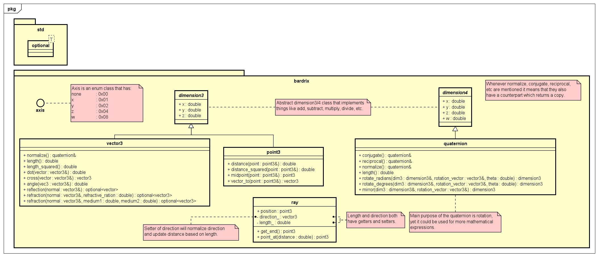

# Bardrix Reference

- [Math](#math)
  - [Math](#math-1)
  - [dimension3](#dimension3)
  - [vector3](#vector3)
  - [point3](#point3)
  - [ray](#ray)

## Bardrix

Bardrix has a main header file that includes all the standard library headers and some important Bardrix headers. \
All other files within the Bardrix library should include this header file. \
It also defines `NODISCARD` and `INLINE` marcos as they are used throughout the library.

## Math

There are a few classes that are used for mathematics, these make the foundation of the library.

### Math

There are a few pre-defined constants and functions that are used throughout the library.

- Constants:
  - `pi`
    - The pi constant.
    - `3.14159265358979323846`
  - `_pi_2`
    - The pi/2 constant.
    - `1.57079632679489661923`
  - `_pi_4`
    - The pi/4 constant.
    - `0.78539816339744830962`
  - `_1_pi`
    - The 1/pi constant.
    - `0.31830988618379067154`
  - `_2_pi`
    - The 2/pi constant.
    - `0.63661977236758134308`
  - `_180_pi`
    - (180 / pi) constant, used for converting radians to degrees.
    - `57.295779513082323`
  - `_pi_180`
    - (pi / 180) constant, used for converting degrees to radians.
    - `0.017453292519943295`
- Methods
  - `degrees_to_radians`
    - Converts degrees to radians.
    - **Returns** the degrees in radians.
    - The type of the degrees must be an arithmetic type, [is_arithmetic](https://en.cppreference.com/w/cpp/types/is_arithmetic).
  - `radians_to_degrees`
    - Converts radians to degrees.
    - **Returns** the radians in degrees.
    - The type of the radians must be an arithmetic type, [is_arithmetic](https://en.cppreference.com/w/cpp/types/is_arithmetic).
  - `nearly_equal`
    - Checks if the number is nearly equal to another number.
    - **Returns** true if the numbers are nearly equal (within bardrix::epsilon).
    - The type of the numbers must be an arithmetic type, [is_arithmetic](https://en.cppreference.com/w/cpp/types/is_arithmetic).
  - `greater_than_or_nearly_equal`
    - Checks if the number is greater than or nearly equal to another number.
    - **Returns** true if the first number is greater than or nearly equal (within bardrix::epsilon) to the second number.
    - The type of the numbers must be an arithmetic type, [is_arithmetic](https://en.cppreference.com/w/cpp/types/is_arithmetic).
  - `less_than_or_nearly_equal`
    - Checks if the number is less than or nearly equal to another number.
    - **Returns** true if the first number is less than or nearly equal (within bardrix::epsilon) to the second number.
    - The type of the numbers must be an arithmetic type, [is_arithmetic](https://en.cppreference.com/w/cpp/types/is_arithmetic).

All comparison functions in `bardrix` use the comparison functions in `math` to compare the numbers, changing the epsilon value will change the comparison value for all the classes.

### dimension3

Abstract class, only used for inheritance, serves as a base for 3D classes; like `vector3` and `point3`.

- Operators:
  - `+`
    - Adds the components of the two of the same `dimension3` objects.
    - Adds the components of the `dimension3` object to the scalar `double` value, either order.
    - **Returns** a new `dimension3` object.
  - `-`
    - Subtracts the components of the two of the same`dimension3` objects.
    - Subtracts the components of the `dimension3` object from the scalar `double` value, either order.
    - **Returns** a new `dimension3` object.
  - `*`
    - Multiplies the components of the `dimension3` object by the scalar `double` value, either order.
    - **Returns** a new `dimension3` object.
  - `/`
    - Divides the components of the `dimension3` object by the scalar `double` value.
    - **Returns** a new `dimension3` object.
    - When dividing by zero, the function will throw an std::invalid_argument exception.
  - `%`
    - Calculates the modulus of the components of the `dimension3` object by the scalar `double` value.
    - **Returns** a new `dimension3` object.
    - When dividing by zero, the function will throw an std::invalid_argument exception.
  - `+=`
    - Adds the components of the two of the same `dimension3` objects.
    - Adds the components of the `dimension3` object to the scalar `double` value, either order.
    - **Returns** a reference to the `dimension3` object.
  - `-=`
    - Subtracts the components of the two of the same `dimension3` objects.
    - Subtracts the components of the `dimension3` object from the scalar `double` value, either order.
    - **Returns** a reference to the `dimension3` object.
  - `*=`
    - Multiplies the components of the `dimension3` object by the scalar `double` value, either order.
    - **Returns** a reference to the `dimension3` object.
  - `/=`
    - Divides the components of the `dimension3` object by the scalar `double` value.
    - **Returns** a reference to the `dimension3` object.
    - When dividing by zero, the function will throw an std::invalid_argument exception.
  - `%=`
    - Calculates the modulus of the components of the `dimension3` object by the scalar `double` value.
    - **Returns** a reference to the `dimension3` object.
    - When dividing by zero, the function will throw an std::invalid_argument exception.
  - `==`
    - Compares the components of the two of the same `dimension3` objects.
    - Compares the components of the `dimension3` object to the scalar `double` value, only `dimension3 == double` order.
    - **Returns** a boolean value, true if the components are nearly equal (within bardrix::epsilon).
  - `!=`
    - Compares the components of the two of the same `dimension3` objects.
    - **Returns** a boolean value, true if the components are not nearly equal (within bardrix::epsilon).
  - `<`
    - Compares the components of the two of the same `dimension3` objects.
    - **Returns** a boolean value, true if the components are less than the other.
  - `>`
    - Compares the components of the two of the same `dimension3` objects.
    - **Returns** a boolean value, true if the components are greater than the other.
  - `<=`
    - Compares the components of the two of the same `dimension3` objects.
    - **Returns** a boolean value, true if the components are less than or nearly equal (within bardrix::epsilon) to the other.
  - `>=`
    - Compares the components of the two of the same `dimension3` objects.
    - **Returns** a boolean value, true if the components are greater than or nearly equal (within bardrix::epsilon) to the other.
  - `-`
    - Negates the components of the `dimension3` object e.g. `vector3(1, 2, 3)` becomes `vector3(-1, -2, -3)`.
    - **Returns** a new `dimension3` object.
  - `--`
    - Decrements the components of the `dimension3` object by 1.
    - **Returns** a reference to the `dimension3` object, pre-decrement.
    - **Returns** a new `dimension3` object, post-decrement.
  - `++`
    - Increments the components of the `dimension3` object by 1.
    - **Returns** a reference to the `dimension3` object, pre-increment.
    - **Returns** a new `dimension3` object, post-increment.
  - `<<`
    - Outputs the components of the `dimension3` object to the output stream.
    - The implementation of which is within the derived classes under the `print` method, as it is a pure virtual function.
    - **Returns** a reference to the output stream.
  - `print(std::ostream &os)`
    - Pure virtual function that requires the derived classes to implement the output of the components to the output stream.

### vector3

A 3D vector class that inherits from `dimension3`. \
Copy and move constructors are implicitly defined.

- Constructors:
  - Default constructor
    - Initializes the vector to (0, 0, 0).
  - Parameterized constructor
    - Initializes the vector to the given x, y, and z values.
- Methods:
  - `length()`
    - Calculates the [length/magnitude](Mathematics.md#magnitudelength) of the vector.
    - **Returns** the length of the vector.
  - `length_squared()`
    - Calculates the squared [length/magnitude](Mathematics.md#magnitudelength) of the vector.
    - **Returns** the squared length of the vector.
    - This is faster than the `length` method as it does not require a square root calculation.
  - `normalize()`
    - [Normalizes](Mathematics.md#normalization) the vector and 
    - **Returns** a reference to the vector, this allows for chaining of the method.
    - When the length of the vector is zero, it will return the original vector.
  - `normalized()`
    - [Normalizes](Mathematics.md#normalization) the vector.
    - **Returns** a new vector that is normalized.
    - When the length of the vector is zero, it will return the original vector.
  - `dot(vector : vector3)`
    - Calculates the [dot product](Mathematics.md#dot-product) of the vector with another vector.
    - **Returns** the dot product of the two vectors.
  - `cross(vector : vector3)`
    - Calculates the [cross product](Mathematics.md#cross-product) of the vector with another vector.
    - **Returns** the cross product of the two vectors.
  - `angle(vector : vector3)`
    - Calculates the [angle](Mathematics.md#angle-between-vectors) between the vector and another vector.
    - **Returns** the angle between the two vectors between [-1, 1].
    - When the angle is 1, the vectors are parallel, when the angle is -1, the vectors are opposite.
    - The arccos can be taken from the result to get the angle in radians.
  - `reflect(normal : vector3)`
    - [Reflects](Mathematics.md#reflection) the vector about a normal vector.
    - The normal and vector will be normalized for you.
    - **Returns** a new vector, the reflected vector will have a length of 1.
    - If any degenerate cases are met, the function will return an std::nullopt
    - **Degenerate cases**:
      - The vector and normal vector must have a length greater than zero.
      - The vector has to be pointing towards the normal vector.
  - `refract(normal : vector3, refractive_ratio : double)`
  - `refract(normal : vector3, medium1 : double, medium2 : double)`
    - [Refracts](Mathematics.md#refraction) the vector through a normal vector.
    - The normal and vector will be normalized for you.
    - **Returns** a new vector, the refracted vector will have a length of 1.
    - If any degenerate cases are met, the function will return an std::nullopt
    - **Degenerate cases**:
      - The vector and normal vector must have a length greater than zero.
      - The refractive medium2 must be greater than zero.
      - The refractive ratio (medium1 / medium2) must be greater than zero.
      - There mustn't be total internal reflection.
  - `print(std::ostream &os)`
    - Outputs the components of the vector to the output stream.
    - **Returns** a reference to the output stream. (x, y, z)

### point3

A 3D point class that inherits from `dimension3`. \
Copy and move constructors are implicitly defined.

- Constructors:
  - Default constructor
    - Initializes the point to (0, 0, 0).
  - Parameterized constructor
    - Initializes the point to the given x, y, and z values.
- Methods:
  - `distance(point : point3)`
    - Calculates the [distance](Mathematics.md#distance) between the point and another point.
    - **Returns** the distance between the two points.
  - `distance_squared(point : point3)`
    - Calculates the squared [distance](Mathematics.md#distance) between the point and another point.
    - **Returns** the squared distance between the two points.
    - This is faster than the `distance` method as it does not require a square root calculation.
  - `midpoint(point : point3)`
    - Calculates the [midpoint/center](Mathematics.md#center) between the point and another point.
    - **Returns** the midpoint between the two points.
  - `vector_to(point : point3)`
    - Calculates the [point to vector](Mathematics.md#point-to-vector) from the point to another point.
    - **Returns** the vector from the point to the other point.
  - `+`
    - Allows for addition of a vector to a point.
    - **Returns** a new point that is the result of the addition.
  - `-`
    - Allows for subtraction of a vector from a point.
    - **Returns** a new point that is the result of the subtraction.
  - `print(std::ostream &os)`
    - Outputs the components of the point to the output stream.
    - **Returns** a reference to the output stream. (x, y, z)

### ray

A 3D ray class that has a point, direction and length. \
Copy and move constructors are implicitly defined.

- Constructors:
  - Default constructor
    - Initializes the ray to (0, 0, 0) and (0, 0, 1) with a length of 1.
  - Parameterized constructor
    - Initialized the position, direction, and length.
      - The direction will be normalized for you.
    - Initializes the ray to the given position and direction.
      - The direction length will be used to set the length of the ray.
      - The direction will be normalized for you.
    - Initializes the direction.
      - The direction length will be used to set the length of the ray.
      - The direction will be normalized for you.
      - The position will be set to (0, 0, 0).
- Setters/Getters:
  - `set_direction(vector : vector3)`
    - Sets the direction of the ray.
    - The direction will be normalized for you.
  - `set_length(length : double)`
    - Sets the length of the ray.
    - If the length is less than zero, it will be set to zero.
  - `get_direction()`
    - **Returns** the normalized direction of the ray.
  - `get_length()`
    - **Returns** the length of the ray.
- Methods:
  - `point_at(distance : double)`
    - Calculates the point at a distance along the ray.
    - **Returns** the point at the distance along the ray.
    - **Degenerate cases**:
      - If the length of the ray is zero, the function will return the position of the ray.
  - `get_end()`
    - **Returns** the point at the end of the ray.
  - `print(std::ostream &os)`
    - Outputs the components of the ray to the output stream.
    - **Returns** a reference to the output stream. (position, direction, length)
- Operators:
  - `==`
    - Compares the position, direction, and length of the two rays.
    - **Returns** a boolean value, true if the rays are equal.
  - `!=`
    - Compares the position, direction, and length of the two rays.
    - **Returns** a boolean value, true if the rays are not equal.

