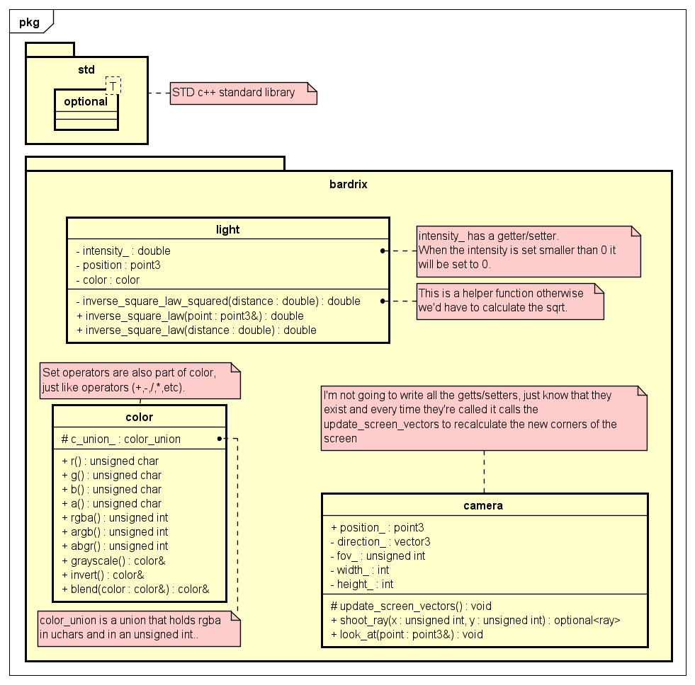

# Bardrix Reference

- [Math](#math)
    - [Math](#math-1)
    - [dimension3](#dimension3)
    - [vector3](#vector3)
    - [point3](#point3)
    - [ray](#ray)
    - [dimension4](#dimension4)
    - [quaternion](#quaternion)
- [View](#view)
    - [Light](#light)
    - [Color](#color)
    - [Camera](#camera)
- [Objects](#objects)
    - [Material](#material)
    - [Shape](#shape)

## Bardrix

Bardrix has a main header file that includes all the standard library headers and some important Bardrix headers. \
All other files within the Bardrix library should include this header file. \
It also defines `NODISCARD` and `INLINE` marcos as they are used throughout the library.

## Math

There are a few classes that are used for mathematics, these make the foundation of the library.

### Math

There are a few pre-defined constants and functions that are used throughout the library.

- Constants:
    - `pi`
        - The pi constant.
        - `3.14159265358979323846`
    - `_pi_2`
        - The pi/2 constant.
        - `1.57079632679489661923`
    - `_pi_4`
        - The pi/4 constant.
        - `0.78539816339744830962`
    - `_1_pi`
        - The 1/pi constant.
        - `0.31830988618379067154`
    - `_2_pi`
        - The 2/pi constant.
        - `0.63661977236758134308`
    - `_180_pi`
        - (180 / pi) constant, used for converting radians to degrees.
        - `57.295779513082323`
    - `_pi_180`
        - (pi / 180) constant, used for converting degrees to radians.
        - `0.017453292519943295`
- Methods
    - `degrees_to_radians(degrees : arithmetic)`
        - Converts degrees to radians.
        - **Returns** the degrees in radians.
        - The type of the degrees must be an arithmetic
          type, [is_arithmetic](https://en.cppreference.com/w/cpp/types/is_arithmetic).
    - `radians_to_degrees(radians : arithmetic)`
        - Converts radians to degrees.
        - **Returns** the radians in degrees.
        - The type of the radians must be an arithmetic
          type, [is_arithmetic](https://en.cppreference.com/w/cpp/types/is_arithmetic).
    - `nearly_equal(lhs : arithmetic, rhs : arithmetic)`
        - Checks if the number is nearly equal to another number.
        - **Returns** true if the numbers are nearly equal (within bardrix::epsilon).
        - The type of the numbers must be an arithmetic
          type, [is_arithmetic](https://en.cppreference.com/w/cpp/types/is_arithmetic).
    - `greater_than_or_nearly_equal(lhs : arithmetic, rhs : arithmetic)`
        - Checks if the number is greater than or nearly equal to another number.
        - **Returns** true if the first number is greater than or nearly equal (within bardrix::epsilon) to the second
          number.
        - The type of the numbers must be an arithmetic
          type, [is_arithmetic](https://en.cppreference.com/w/cpp/types/is_arithmetic).
    - `less_than_or_nearly_equal(lhs : arithmetic, rhs : arithmetic)`
        - Checks if the number is less than or nearly equal to another number.
        - **Returns** true if the first number is less than or nearly equal (within bardrix::epsilon) to the second
          number.
        - The type of the numbers must be an arithmetic
          type, [is_arithmetic](https://en.cppreference.com/w/cpp/types/is_arithmetic).

All comparison functions in `bardrix` use the comparison functions in `math` to compare the numbers, changing the
epsilon value will change the comparison value for all the classes.

### dimension3

Abstract class, only used for inheritance, serves as a base for 3D classes; like `vector3` and `point3`. \
It has base variables for `x`, `y` and `z`.

- Methods:
    - `print(std::ostream &os)`
        - Pure virtual function that requires the derived classes to implement the output of the components to the
          output stream.
- Operators:
    - `+`
        - Adds the components of the two of the same `dimension3` objects.
        - Adds the components of the `dimension3` object to the scalar `double` value, either order.
        - **Returns** a new `dimension3` object.
    - `-`
        - Subtracts the components of the two of the same`dimension3` objects.
        - Subtracts the components of the `dimension3` object from the scalar `double` value, either order.
        - **Returns** a new `dimension3` object.
    - `*`
        - Multiplies the components of the `dimension3` object by the scalar `double` value, either order.
        - **Returns** a new `dimension3` object.
    - `/`
        - Divides the components of the `dimension3` object by the scalar `double` value.
        - **Returns** a new `dimension3` object.
        - **Degenerate cases**:
          - When dividing by zero, the function will throw an std::invalid_argument exception.
    - `%`
        - Calculates the modulus of the components of the `dimension3` object by the scalar `double` value.
        - **Returns** a new `dimension3` object.
        - **Degenerate cases**:
          - When dividing by zero, the function will throw an std::invalid_argument exception.
    - `+=`
        - Adds the components of the two of the same `dimension3` objects.
        - Adds the components of the `dimension3` object to the scalar `double` value, either order.
        - **Returns** a reference to the `dimension3` object.
    - `-=`
        - Subtracts the components of the two of the same `dimension3` objects.
        - Subtracts the components of the `dimension3` object from the scalar `double` value, either order.
        - **Returns** a reference to the `dimension3` object.
    - `*=`
        - Multiplies the components of the `dimension3` object by the scalar `double` value, either order.
        - **Returns** a reference to the `dimension3` object.
    - `/=`
        - Divides the components of the `dimension3` object by the scalar `double` value.
        - **Returns** a reference to the `dimension3` object.
        - **Degenerate cases**:
          - When dividing by zero, the function will throw an std::invalid_argument exception.
    - `%=`
        - Calculates the modulus of the components of the `dimension3` object by the scalar `double` value.
        - **Returns** a reference to the `dimension3` object.
        - **Degenerate cases**:
          - When dividing by zero, the function will throw an std::invalid_argument exception.
    - `==`
        - Compares the components of the two of the same `dimension3` objects.
        - Compares the components of the `dimension3` object to the scalar `double` value, only `dimension3 == double`
          order.
        - **Returns** a boolean value, true if the components are nearly equal (within bardrix::epsilon).
    - `!=`
        - Compares the components of the two of the same `dimension3` objects.
        - **Returns** a boolean value, true if the components are not nearly equal (within bardrix::epsilon).
    - `<`
        - Compares the components of the two of the same `dimension3` objects.
        - **Returns** a boolean value, true if the components are less than the other.
    - `>`
        - Compares the components of the two of the same `dimension3` objects.
        - **Returns** a boolean value, true if the components are greater than the other.
    - `<=`
        - Compares the components of the two of the same `dimension3` objects.
        - **Returns** a boolean value, true if the components are less than or nearly equal (within bardrix::epsilon) to
          the other.
    - `>=`
        - Compares the components of the two of the same `dimension3` objects.
        - **Returns** a boolean value, true if the components are greater than or nearly equal (within bardrix::epsilon)
          to the other.
    - `-`
        - Negates the components of the `dimension3` object e.g. `vector3(1, 2, 3)` becomes `vector3(-1, -2, -3)`.
        - **Returns** a new `dimension3` object.
    - `--`
        - Decrements the components of the `dimension3` object by 1.
        - **Returns** a reference to the `dimension3` object, pre-decrement.
        - **Returns** a new `dimension3` object, post-decrement.
    - `++`
        - Increments the components of the `dimension3` object by 1.
        - **Returns** a reference to the `dimension3` object, pre-increment.
        - **Returns** a new `dimension3` object, post-increment.
    - `<<`
        - Outputs the components of the `dimension3` object to the output stream.
        - The implementation of which is within the derived classes under the `print` method, as it is a pure virtual
          function.
        - **Returns** a reference to the output stream.

### vector3

A 3D vector class that inherits from `dimension3`. \
Copy and move constructors are implicitly defined.

- Constructors:
    - Default constructor
        - Initializes the vector to (0, 0, 0).
    - Parameterized constructor
        - Initializes the vector to the given x, y, and z values.
- Methods:
    - `length()`
        - Calculates the [length/magnitude](Mathematics.md#magnitudelength) of the vector.
        - **Returns** the length of the vector.
    - `length_squared()`
        - Calculates the squared [length/magnitude](Mathematics.md#magnitudelength) of the vector.
        - **Returns** the squared length of the vector.
        - This is faster than the `length` method as it does not require a square root calculation.
    - `normalize()`
        - [Normalizes](Mathematics.md#normalization) the vector and
        - **Returns** a reference to the vector, this allows for chaining of the method.
        - **Degenerate cases**:
          - When the length of the vector is zero, it will return the original vector.
    - `normalized()`
        - [Normalizes](Mathematics.md#normalization) the vector.
        - **Returns** a new vector that is normalized.
        - **Degenerate cases**:
          - When the length of the vector is zero, it will return the original vector.
    - `dot(vector : vector3)`
        - Calculates the [dot product](Mathematics.md#dot-product) of the vector with another vector.
        - **Returns** the dot product of the two vectors.
    - `cross(vector : vector3)`
        - Calculates the [cross product](Mathematics.md#cross-product) of the vector with another vector.
        - **Returns** the cross product of the two vectors.
    - `angle(vector : vector3)`
        - Calculates the [angle](Mathematics.md#angle-between-vectors) between the vector and another vector.
        - **Returns** the angle between the two vectors between [-1, 1].
        - When the angle is 1, the vectors are parallel, when the angle is -1, the vectors are opposite.
        - The arccos can be taken from the result to get the angle in radians.
    - `reflection(normal : vector3)`
        - [Reflects](Mathematics.md#reflection) the vector about a normal vector.
        - The normal and vector will be normalized for you.
        - **Returns** a new vector, the reflected vector will have a length equal to the original vector.
        - If any degenerate cases are met, the function will return an std::nullopt
        - **Degenerate cases**:
            - The vector and normal vector must have a length greater than zero.
            - The vector has to be pointing towards the normal vector.
    - `refraction(normal : vector3, refractive_ratio : double)`
    - `refraction(normal : vector3, medium1 : double, medium2 : double)`
        - [Refracts](Mathematics.md#refraction) the vector through a normal vector.
        - The normal and vector will be normalized for you.
        - **Returns** a new vector, the refracted vector will have a length of 1.
        - If any degenerate cases are met, the function will return an std::nullopt
        - **Degenerate cases**:
            - The vector and normal vector must have a length greater than zero.
            - The refractive medium2 must be greater than zero.
            - The refractive ratio (medium1 / medium2) must be greater than zero.
            - There mustn't be total internal reflection.
    - `print(std::ostream &os)`
        - Outputs the components of the vector to the output stream.
        - **Returns** a reference to the output stream. (x, y, z)

### point3

A 3D point class that inherits from `dimension3`. \
Copy and move constructors are implicitly defined.

- Constructors:
    - Default constructor
        - Initializes the point to (0, 0, 0).
    - Parameterized constructor
        - Initializes the point to the given x, y, and z values.
- Methods:
    - `distance(point : point3)`
        - Calculates the [distance](Mathematics.md#distance) between the point and another point.
        - **Returns** the distance between the two points.
    - `distance_squared(point : point3)`
        - Calculates the squared [distance](Mathematics.md#distance) between the point and another point.
        - **Returns** the squared distance between the two points.
        - This is faster than the `distance` method as it does not require a square root calculation.
    - `midpoint(point : point3)`
        - Calculates the [midpoint/center](Mathematics.md#center) between the point and another point.
        - **Returns** the midpoint between the two points.
    - `vector_to(point : point3)`
        - Calculates the [point to vector](Mathematics.md#point-to-vector) from the point to another point.
        - **Returns** the vector from the point to the other point.
    - `+`
        - Allows for addition of a vector to a point.
        - **Returns** a new point that is the result of the addition.
    - `-`
        - Allows for subtraction of a vector from a point.
        - **Returns** a new point that is the result of the subtraction.
    - `print(std::ostream &os)`
        - Outputs the components of the point to the output stream.
        - **Returns** a reference to the output stream. (x, y, z)

### ray

A 3D ray class that has a point, direction and length. \
Copy and move constructors are implicitly defined.

- Constructors:
    - Default constructor
        - Initializes the ray to (0, 0, 0) and (0, 0, 1) with a length of 1.
    - Parameterized constructor
        - Initialized the position, direction, and length.
            - The direction will be normalized for you.
        - Initializes the ray to the given position and direction.
            - The direction length will be used to set the length of the ray.
            - The direction will be normalized for you.
        - Initializes the direction.
            - The direction length will be used to set the length of the ray.
            - The direction will be normalized for you.
            - The position will be set to (0, 0, 0).
- Setters/Getters:
    - `set_direction(vector : vector3)`
        - Sets the direction of the ray.
        - The direction will be normalized for you.
    - `set_length(length : double)`
        - Sets the length of the ray.
        - **Degenerate cases**:
          - If the length is less than zero, it will be set to zero.
    - `get_direction()`
        - **Returns** the normalized direction of the ray.
    - `get_length()`
        - **Returns** the length of the ray.
- Methods:
    - `point_at(distance : double)`
        - Calculates the point at a distance along the ray.
        - **Returns** the point at the distance along the ray.
        - **Degenerate cases**:
            - If the length of the ray is zero, the function will return the position of the ray.
    - `get_end()`
        - **Returns** the point at the end of the ray.
    - `print(std::ostream &os)`
        - Outputs the components of the ray to the output stream.
        - **Returns** a reference to the output stream. (position, direction, length)
- Operators:
    - `==`
        - Compares the position, direction, and length of the two rays.
        - **Returns** a boolean value, true if the rays are equal.
    - `!=`
        - Compares the position, direction, and length of the two rays.
        - **Returns** a boolean value, true if the rays are not equal.

## dimension4

Abstract class, only used for inheritance, serves as a base for 3D classes; like `vector3` and `point3`. \
It has base variables for `x`, `y`, `z`, and `w`.

- Methods:
    - `print(std::ostream &os)`
        - Pure virtual function that requires the derived classes to implement the output of the components to the
          output stream.
- Operators:
    - `+`
        - Adds the components of the two of the same `dimension4` objects.
        - Adds the components of the `dimension4` object to the scalar `double` value, either order.
        - **Returns** a new `dimension4` object.
    - `-`
        - Subtracts the components of the two of the same`dimension4` objects.
        - Subtracts the components of the `dimension4` object from the scalar `double` value, either order.
        - **Returns** a new `dimension4` object.
    - `*`
        - Multiplies the components of the `dimension4` object by the scalar `double` value, either order.
        - **Returns** a new `dimension4` object.
    - `/`
        - Divides the components of the `dimension4` object by the scalar `double` value.
        - **Returns** a new `dimension4` object.
        - **Degenerate cases**:
          - When dividing by zero, the function will throw an std::invalid_argument exception.
    - `%`
        - Calculates the modulus of the components of the `dimension4` object by the scalar `double` value.
        - **Returns** a new `dimension4` object.
        - **Degenerate cases**:
          - When dividing by zero, the function will throw an std::invalid_argument exception.
    - `+=`
        - Adds the components of the two of the same `dimension4` objects.
        - Adds the components of the `dimension4` object to the scalar `double` value, either order.
        - **Returns** a reference to the `dimension4` object.
    - `-=`
        - Subtracts the components of the two of the same `dimension4` objects.
        - Subtracts the components of the `dimension4` object from the scalar `double` value, either order.
        - **Returns** a reference to the `dimension4` object.
    - `*=`
        - Multiplies the components of the `dimension4` object by the scalar `double` value, either order.
        - **Returns** a reference to the `dimension4` object.
    - `/=`
        - Divides the components of the `dimension4` object by the scalar `double` value.
        - **Returns** a reference to the `dimension4` object.
        - **Degenerate cases**:
          - When dividing by zero, the function will throw an std::invalid_argument exception.
    - `%=`
        - Calculates the modulus of the components of the `dimension4` object by the scalar `double` value.
        - **Returns** a reference to the `dimension4` object.
        - **Degenerate cases**:
          - When dividing by zero, the function will throw an std::invalid_argument exception.
    - `==`
        - Compares the components of the two of the same `dimension4` objects.
        - Compares the components of the `dimension4` object to the scalar `double` value, only `dimension4 == double`
          order.
        - **Returns** a boolean value, true if the components are nearly equal (within bardrix::epsilon).
    - `!=`
        - Compares the components of the two of the same `dimension4` objects.
        - **Returns** a boolean value, true if the components are not nearly equal (within bardrix::epsilon).
    - `<`
        - Compares the components of the two of the same `dimension4` objects.
        - **Returns** a boolean value, true if the components are less than the other.
    - `>`
        - Compares the components of the two of the same `dimension4` objects.
        - **Returns** a boolean value, true if the components are greater than the other.
    - `<=`
        - Compares the components of the two of the same `dimension4` objects.
        - **Returns** a boolean value, true if the components are less than or nearly equal (within bardrix::epsilon) to
          the other.
    - `>=`
        - Compares the components of the two of the same `dimension4` objects.
        - **Returns** a boolean value, true if the components are greater than or nearly equal (within bardrix::epsilon)
          to the other.
    - `-`
        - Negates the components of the `dimension4` object e.g. `quaternion(1, 2, 3, 4)`
          becomes `quaternion(-1, -2, -3, -4)`.
        - **Returns** a new `dimension4` object.
    - `--`
        - Decrements the components of the `dimension4` object by 1.
        - **Returns** a reference to the `dimension4` object, pre-decrement.
        - **Returns** a new `dimension4` object, post-decrement.
    - `++`
        - Increments the components of the `dimension4` object by 1.
        - **Returns** a reference to the `dimension4` object, pre-increment.
        - **Returns** a new `dimension4` object, post-increment.
    - `<<`
        - Outputs the components of the `dimension4` object to the output stream.
        - The implementation of which is within the derived classes under the `print` method, as it is a pure virtual
          function.
        - **Returns** a reference to the output stream.

### quaternion

A 4D quaternion class that has a real and imaginary part. \
It's main purpose is for rotation in 3D space; it can be used for other mathematical purposes too. \
It inherits from `dimension4`, the real part is the `w` component and the imaginary part is the `x`, `y`, and `z`
components. \
Copy and move constructors are implicitly defined.

- Constructors:
    - Default constructor
        - Initializes the quaternion to (0, 0, 0, 1).
    - Parameterized constructor
        - Initializes the quaternion to the given real and imaginary parts.
- Methods:
    - `identity()`
        - Statically defined method, only used for the identity quaternion.
        - **Returns** the identity quaternion; (0, 0, 0, 1).
        - The identity quaternion is used for rotations that don't change the vector.
    - `conjugate()`
        - Changes the sign of the imaginary part of the quaternion.
        - **Returns** a reference to the quaternion, this allows for chaining of the method.
        - The conjugate is used for inverting the quaternion.
    - `conjugated()`
        - Changes the sign of the imaginary part of the quaternion.
        - **Returns** a new quaternion, the conjugated quaternion.
        - The conjugate is used for inverting the quaternion.
    - `reciprocal()`
        - Calculates the reciprocal of the quaternion.
        - **Returns** a reference to the quaternion, this allows for chaining of the method.
        - **Degenerate cases**:
          - If the quaternion is zero, the original quaternion will be returned.
    - `reciprocated()`
        - Calculates the reciprocal of the quaternion.
        - **Returns** a new quaternion, the reciprocated quaternion.
        - **Degenerate cases**:
          - If the quaternion is zero, the original quaternion will be returned.
    - `normalize()`
        - Normalizes the quaternion.
        - **Returns** a reference to the quaternion, this allows for chaining of the method.
        - **Degenerate cases**:
            - If the quaternion is zero, the original quaternion will be returned.
    - `normalized()`
        - Normalizes the quaternion.
        - **Returns** a new quaternion, the normalized quaternion.
        - **Degenerate cases**:
            - If the quaternion is zero, the original quaternion will be returned.
    - `length()`
        - Calculates the [length/magnitude](Mathematics.md#magnitudelength) of the quaternion.
        - **Returns** the length of the quaternion.
    - `rotate_radians(dim3 : dimension3, rotation_vector : vector3, theta : double)`
        - Rotates the quaternion by the given angle (theta) in radians about the given axis (rotation_vector).
        - **Returns** the rotated dimension3 object.
        - **Degenerate cases**:
            - If the dim3 or rotation_vector is zero, the original dimension3 object will be returned.
            - If the theta is zero, the original dimension3 object will be returned.
    - `rotate_degrees(dim3 : dimension3, rotation_vector : vector3, theta : double)`
        - Rotates the quaternion by the given angle (theta) in degrees about the given axis (rotation_vector).
        - **Returns** the rotated dimension3 object.
        - **Degenerate cases**:
            - If the dim3 or rotation_vector is zero, the original dimension3 object will be returned.
            - If the theta is zero, the original dimension3 object will be returned.
    - `mirror(dim3 : dimension3, mirror_vector : vector3)`
        - Mirrors the quaternion about the given axis (mirror_vector).
        - This would be equivalent to rotating the quaternion by 180 degrees about the mirror_vector, but is slightly
          faster.
        - **Returns** the mirrored dimension3 object.
        - **Degenerate cases**:
            - If the dim3 or mirror_vector is zero, the original dimension3 object will be returned.
    - `print(std::ostream &os)`
        - Outputs the components of the quaternion to the output stream.
        - **Returns** a reference to the output stream. quaternion({x}i, {y}j, {z}k, {w}) where x, y, z and w are to be
          replaced with the values of the quaternion.
- Operators:
    - `*`
        - Calculates the [Hamilton product](Mathematics.md#hamilton-product) of the two quaternions.
        - **Returns** a new quaternion, the result of the Hamilton product.
        - The Hamilton product is used for combining rotations.

## View

This part includes all the classes that are used for the visual aspect of raytracing. \
This includes the camera, light, color etc.

### Light

A class that represents a light source in the scene. \
It has a position, color, and intensity.

- Constructors:
    - Default constructor
        - Initializes the light to (0, 0, 0) with a white color and intensity of 1.
    - Parameterized constructor
        - Initializes the light to the given position, color, and intensity.
- Setters/Getters:
    - `set_intensity(intensity : double)`
        - Sets the intensity of the light.
        - **Degenerate cases**:
            - If the intensity is less than zero, it will be set to zero.
    - `get_intensity()`
        - **Returns** the intensity of the light.
- Methods:
    - `inverse_square_law(distance : double)`
        - Calculates the [inverse square law](Mathematics.md#inverse-square-law) of the light at a distance.
        - **Returns** the intensity of the light at the distance.
        - **Degenerate cases**:
            - If the distance is less than zero, it will be treated as the absolute value.
            - If the distance is zero, `HUGE_VAL` (which is infinity for double) will be returned.
    - `inverse_square_law(point : point3)`
        - Calculates the [inverse square law](Mathematics.md#inverse-square-law) of the light at a point.
        - **Returns** the intensity of the light at the point.
        - **Degenerate cases**:
            - If the point is the same as the light position, `HUGE_VAL` (which is infinity for double) will be
              returned.
    - `print(std::ostream &os)`
        - Outputs the components of the light to the output stream.
        - **Returns** a reference to the output stream. (position, color, intensity)
- Operators:
    - `==`
        - Compares the position, color, and intensity of the two lights.
        - **Returns** a boolean value, true if the lights are equal.
        - The comparison of the color is done with the `==` operator in the `color` class.
    - `!=`
        - Compares the position, color, and intensity of the two lights.
        - **Returns** a boolean value, true if the lights are not equal.
        - The comparison of the color is done with the `!=` operator in the `color` class.
    - `<<`
        - Outputs the components of the light to the output stream.
        - **Returns** a reference to the output stream.

### Color

A class that represents a color in the scene. \
It has red, green, blue, and alpha components.

- Constructors:
    - Default constructor
        - Initializes the color to (0, 0, 0, 0).
    - Parameterized constructor
        - Initializes the color to the given red, green, blue, and alpha values.
        - Initializes the color to the given uint32_t value. (RRGGBBAA).
- Setters/Getters:
    - `r(r : uchar)`
        - Sets the red component of the color.
    - `g(g : uchar)`
        - Sets the green component of the color.
    - `b(b : uchar)`
        - Sets the blue component of the color.
    - `a(a : uchar)`
        - Sets the alpha component of the color.
    - `rgba(rgba : uint32_t)`
        - Sets the red, green, blue, and alpha components of the color.
        - It's important to note that the order is RRGGBBAA.
        - The components will be stored the same way as the `r`, `g`, `b`, and `a` methods.
    - `abgr(abgr : uint32_t)`
        - Sets the red, green, blue, and alpha components of the color.
        - It's important to note that the order is AABBGGRR.
        - The components will be stored the same way as the `r`, `g`, `b`, and `a` methods.
    - `argb(argb : uint32_t)`
        - Sets the red, green, blue, and alpha components of the color.
        - It's important to note that the order is AARRGGBB.
        - The components will be stored the same way as the `r`, `g`, `b`, and `a` methods.
    - `r()`
        - **Returns** the red component of the color.
    - `g()`
        - **Returns** the green component of the color.
    - `b()`
        - **Returns** the blue component of the color.
    - `a()`
        - **Returns** the alpha component of the color.
    - `rgba()`
        - **Returns** the uint32_t value of the color in the format RRGGBBAA.
        - It's important to note that the order is RRGGBBAA.
    - `abgr()`
        - **Returns** the uint32_t value of the color in the format AABBGGRR.
        - It's important to note that the order is AABBGGRR.
    - `argb()`
        - **Returns** the uint32_t value of the color in the format AARRGGBB.
        - It's important to note that the order is AARRGGBB.
    - `invert()`
        - Inverts the color, not the alpha component. (255 - r, 255 - g, 255 - b, a)
        - **Returns** a reference to the color, this allows for chaining of the method.
    - `inverted()`
        - Inverts the color, not the alpha component. (255 - r, 255 - g, 255 - b, a)
        - **Returns** a new color, the inverted color.
    - `grayscale()`
        - Converts the color to grayscale, not the alpha component.
        - Formula: 0.299 * r + 0.587 * g + 0.114 * b for the red, green, and blue components; the alpha component
          will remain the same.
        - **Returns** a reference to the color, this allows for chaining of the method.
    - `grayscaled()`
        - Converts the color to grayscale, not the alpha component.
        - Formula: 0.299 * r + 0.587 * g + 0.114 * b for the red, green, and blue components; the alpha component
          will remain the same.
        - **Returns** a new color, the grayscaled color.
    - `print(std::ostream &os)`
        - Outputs the components of the color to the output stream.
        - **Returns** a reference to the output stream. (r, g, b, a)
- Operators:
    - `+`
        - Adds the components of the two colors, or adds the scalar `unsigned char` value to the components; either
          order
        - The components will get clamped to the range of 0 to 255.
        - **Returns** a new color.
    - `-`
        - Subtracts the components of the two colors, or subtracts the scalar `unsigned char` value from the components;
          either order
        - The components will get clamped to the range of 0 to 255.
        - **Returns** a new color.
    - `*`
        - Multiplies the components of the color by the scalar `double` value; either order.
        - The components will get clamped to the range of 0 to 255.
        - **Returns** a new color.
    - `/`
        - Divides the components of the color by the scalar `double` value.
        - The components will get clamped to the range of 0 to 255.
        - **Returns** a new color.
        - **Degenerate cases**:
            - When dividing by zero, the function will throw an std::invalid_argument exception.
            - When the scalar is negative, the function will throw an std::invalid_argument exception.
    - `%`
        - Calculates the modulus of the components of the color by the scalar `unsigned char` value.
        - The components will get clamped to the range of 0 to 255.
        - **Returns** a new color.
        - **Degenerate cases**:
            - When dividing by zero, the function will throw an std::invalid_argument exception.
    - `~`
        - Negates the components of the color e.g. `color(1, 2, 3, 4)` becomes `color(255 - 1, 255 - 2, 255 - 3, 4)`.
        - **Returns** a new color.
        - The alpha component will remain the same.
    - `+=``
        - Adds the components of the two colors, or adds the scalar `unsigned char` value to the components; either
          order
        - The components will get clamped to the range of 0 to 255.
        - **Returns** a reference to the color.
    - `-=`
        - Subtracts the components of the two colors, or subtracts the scalar `unsigned char` value from the components;
          either order
        - The components will get clamped to the range of 0 to 255.
        - **Returns** a reference to the color.
    - `*=`
        - Multiplies the components of the color by the scalar `double` value; either order.
        - The components will get clamped to the range of 0 to 255.
        - **Returns** a reference to the color.
    - `/=`
        - Divides the components of the color by the scalar `double` value.
        - The components will get clamped to the range of 0 to 255.
        - **Returns** a reference to the color.
        - **Degenerate cases**:
            - When dividing by zero, the function will throw an std::invalid_argument exception.
            - When the scalar is negative, the function will throw an std::invalid_argument exception.
    - `%=`
        - Calculates the modulus of the components of the color by the scalar `unsigned char` value.
        - The components will get clamped to the range of 0 to 255.
        - **Returns** a reference to the color.
        - **Degenerate cases**:
            - When dividing by zero, the function will throw an std::invalid_argument exception.
    - `==`
        - Compares the red, green, blue, and alpha components of the two colors.
        - **Returns** a boolean value, true if the colors are equal.
    - `!=`
        - Compares the red, green, blue, and alpha components of the two colors.
        - **Returns** a boolean value, true if the colors are not equal.
    - `<`
        - Compares the red, green, blue, and alpha components of the two colors.
        - **Returns** a boolean value, true if the first color is less than the other.
    - `>`
        - Compares the red, green, blue, and alpha components of the two colors.
        - **Returns** a boolean value, true if the first color is greater than the other.
    - `<=`
        - Compares the red, green, blue, and alpha components of the two colors.
        - **Returns** a boolean value, true if the first color is less than or nearly equal (within bardrix::epsilon) to
          the other.
    - `>=`
        - Compares the red, green, blue, and alpha components of the two colors.
        - **Returns** a boolean value, true if the first color is greater than or nearly equal (within bardrix::epsilon)
          to the other.
    - `<<`
        - Outputs the components of the color to the output stream.
        - **Returns** a reference to the output stream.
        - The output will be in the format (r, g, b, a)

### Camera

A class that represents a camera in 3D space. \
It has a position, direction, field of view and width/height of the image.

- Constructors:
    - Default constructor
        - Initializes the camera to (0, 0, 0) with a direction of (0, 0, 1), a field of view of 90 degrees, and a width
          and height of 800x600.
    - Parameterized constructor
        - Initializes the camera to the given position, direction and screen_size.
        - Initializes the camera to the given position, direction, field of view, width and height.
- Setters/Getters:
    - `set_direction(direction : vector3)`
        - Sets the direction of the camera.
        - The direction will be normalized for you.
    - `set_fov(fov : unsigned int)`
        - Sets the field of view of the camera in degrees.
        - **Degenerate cases**:
            - If the field of view is greater than or equal  180, it will be set to 179; as this is the limit.
    - `set_width(width : unsigned int)`
        - Sets the width of the camera image.
        - **Degenerate cases**:
            - If the width is less than zero, it will be set to zero.
    - `set_height(height : unsigned int)`
        - Sets the height of the camera image.
        - **Degenerate cases**:
            - If the height is less than zero, it will be set to zero.
    - `get_direction()`
        - **Returns** the normalized direction of the camera.
    - `get_fov()`
        - **Returns** the field of view of the camera in degrees.
    - `get_width()`
        - **Returns** the width of the camera image.
    - `get_height()`
        - **Returns** the height of the camera image.
- Methods:
    - `look_at(point : point3)`
        - Changes the direction of the camera to look at the given point.
        - **Degenerate cases**:
            - If the point is the same as the position, it will not change the direction.
    - `shoot_ray(x : int, y : int, distance : double)`
        - Shoots a ray from the camera at the given pixel coordinates.
        - **Returns** the ray that was shot from the camera, if the ray is invalid, it will return an std::nullopt.
        - **Degenerate cases**:
            - If the x or y is greater than or equal to the width or height.
            - If the x or y is less than 0.
- Operators:
    - `<<`
        - Outputs the components of the camera to the output stream (Position: (x,y,z), Direction (x,y,z), width, height, fov).
        - **Returns** a reference to the output stream.

## Objects

This part includes classes that are object based, like material, spheres, triangles etc.

### Material

A class that represents a material for an object in the scene. \
It has a color, ambient, diffuse, specular, shininess.

- Constructors:
    - Default constructor
        - Initializes the material to a white color, ambient of 0, diffuse of 1, specular of 0, and shininess of 1.
    - Parameterized constructor
        - Initializes the material to the given color, ambient, diffuse and shininess.
        - Initializes the material to the given color, ambient, diffuse, specular and shininess.
- Setters/Getters:
  - `set_ambient(ambient : double)`
      - Sets the ambience of the material.
      - **Degenerate cases**:
          - If the ambient is less than zero, it will be set to zero.
          - If the ambient is greater than one, it will be set to one.
  - `set_diffuse(diffuse : double)`
      - Sets the diffuseness of the material.
      - **Degenerate cases**:
          - If the diffuse is less than zero, it will be set to zero.
          - If the diffuse is greater than one, it will be set to one.
  - `set_specular(specular : double)`
      - Sets the specularness of the material.
      - **Degenerate cases**:
          - If the specular is less than zero, it will be set to zero.
          - If the specular is greater than one, it will be set to one.
  - `set_shininess(shininess : double)`
      - Sets the shininess of the material.
      - **Degenerate cases**:
          - If the shininess is less than one, it will be set to one.
  - `get_ambient()`
      - **Returns** the ambience of the material.
  - `get_diffuse()`
      - **Returns** the diffuseness of the material.
  - `get_specular()`
      - **Returns** the specularness of the material.
  - `get_shininess()`
      - **Returns** the shininess of the material.

### Shape

Abstract class, only used for inheritance, serves as a base for all the shapes; like `sphere` and `triangle`. \
It has a material, position and a method to check if a ray intersects with the shape.

All methods are pure virtual, and must be implemented in the derived classes.

- Getters/Setters:
    - `set_material(material : material)`
        - Sets the material of the shape.
    - `set_material(material : material)`
        - Sets the material of the shape.
    - `get_material()`
        - **Returns** the material of the shape.
    - `get_position()`
        - **Returns** the position of the shape.
- Methods:
    - `intersect(ray : ray)`
        - Checks if the ray intersects with the shape and calculates the intersection point.
        - **Returns** an optional `point3` of the intersection point.
            - If the ray intersects with the shape, it should return the intersection point.
            - If the ray does not intersect with the shape, it should return an std::nullopt.
    - `normal_at(point : point3)`
        - Calculates the normal of the shape at the given point.
        - **Returns** the normal of the shape at the point.