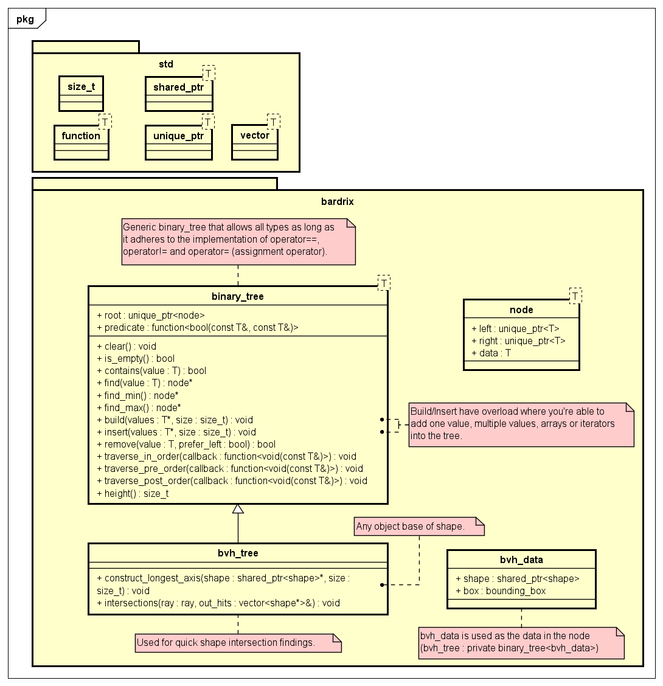

# Bardrix Reference

- [Math](#math)
    - [math](#math-1)
    - [physics](#physics)
    - [dimension3](#dimension3)
    - [vector3](#vector3)
    - [point3](#point3)
    - [ray](#ray)
    - [dimension4](#dimension4)
    - [quaternion](#quaternion)
- [View](#view)
    - [light](#light)
    - [color](#color)
    - [camera](#camera)
- [Objects](#objects)
    - [material](#material)
    - [bounding_box](#boundingbox)
    - [shape](#shape)
    - [sphere](#sphere)
- [Algorithm](#algorithm)
    - [binary_tree](#binarytree)
    - [bvh_tree](#bvhtree)

## Bardrix

Bardrix has a main header file that includes all the standard library headers and some important Bardrix headers. \
All other files within the Bardrix library should include this header file. \
It also defines `NODISCARD` and `INLINE` marcos as they are used throughout the library.

## Math

There are a few classes that are used for mathematics, these make the foundation of the library.


### math

There are a few pre-defined constants and functions that are used throughout the library.

- Constants:
    - `pi`
        - The pi constant.
        - `3.14159265358979323846`
    - `_pi_2`
        - The pi/2 constant.
        - `1.57079632679489661923`
    - `_pi_4`
        - The pi/4 constant.
        - `0.78539816339744830962`
    - `_1_pi`
        - The 1/pi constant.
        - `0.31830988618379067154`
    - `_2_pi`
        - The 2/pi constant.
        - `0.63661977236758134308`
    - `_180_pi`
        - (180 / pi) constant, used for converting radians to degrees.
        - `57.295779513082323`
    - `_pi_180`
        - (pi / 180) constant, used for converting degrees to radians.
        - `0.017453292519943295`
- Methods
    - `degrees_to_radians(degrees : arithmetic)`
        - Converts degrees to radians.
        - **Returns** the degrees in radians.
        - The type of the degrees must be an arithmetic
          type, [is_arithmetic](https://en.cppreference.com/w/cpp/types/is_arithmetic).
    - `radians_to_degrees(radians : arithmetic)`
        - Converts radians to degrees.
        - **Returns** the radians in degrees.
        - The type of the radians must be an arithmetic
          type, [is_arithmetic](https://en.cppreference.com/w/cpp/types/is_arithmetic).
    - `nearly_equal(lhs : arithmetic, rhs : arithmetic)`
        - Checks if the number is nearly equal to another number.
        - **Returns** true if the numbers are nearly equal (within bardrix::epsilon).
        - The type of the numbers must be an arithmetic
          type, [is_arithmetic](https://en.cppreference.com/w/cpp/types/is_arithmetic).
    - `greater_than_or_nearly_equal(lhs : arithmetic, rhs : arithmetic)`
        - Checks if the number is greater than or nearly equal to another number.
        - **Returns** true if the first number is greater than or nearly equal (within bardrix::epsilon) to the second
          number.
        - The type of the numbers must be an arithmetic
          type, [is_arithmetic](https://en.cppreference.com/w/cpp/types/is_arithmetic).
    - `less_than_or_nearly_equal(lhs : arithmetic, rhs : arithmetic)`
        - Checks if the number is less than or nearly equal to another number.
        - **Returns** true if the first number is less than or nearly equal (within bardrix::epsilon) to the second
          number.
        - The type of the numbers must be an arithmetic
          type, [is_arithmetic](https://en.cppreference.com/w/cpp/types/is_arithmetic).

All comparison functions in `bardrix` use the comparison functions in `math` to compare the numbers, changing the
epsilon value will change the comparison value for all the classes.

### physics

- Typedefs:
    - `mass`
        - A typedef for the mass (kilograms).
        - `double`
    - `time`
        - A typedef for the time (seconds).
        - `double`
    - `distance`
        - A typedef for the distance (meters).
        - `double`
    - `velocity`
        - A typedef for the velocity (meters per second).
        - `double`
    - `acceleration`
        - A typedef for the acceleration (meters per second squared).
        - `double`
    - `force`
        - A typedef for the force (newtons).
        - `double`
- Constants:
    - `universal_gravitational_constant`
        - The universal gravitational constant.
        - `6.67430e-11`
- Methods:
    - `calculate_force(m : mass, a : acceleration)`
        - Calculates the force using the formula `F = m * a`.
        - **Returns** the force.
    - `calculate_mass(f : force, a : acceleration)`
        - Calculates the mass using the formula `m = F / a`.
        - **Returns** the mass.
        - **Degenerate cases**:
            - If acceleration is zero, aka dividing by zero, the function will throw an std::invalid_argument exception.
    - `calculate_acceleration(f : force, m : mass)`
        - Calculates the acceleration using the formula `a = F / m`.
        - **Returns** the acceleration.
        - **Degenerate cases**:
            - If mass is zero, aka dividing by zero, the function will throw an std::invalid_argument exception.
    - `calculate_velocity(a : acceleration, t : time)`
        - Calculates the velocity using the formula `v = a * t`.
        - **Returns** the velocity.
    - `calculate_velocity(f : force, m : mass, t : time)`
        - Calculates the velocity using the formula `v = (F / m) * t`.
        - **Returns** the velocity.
        - **Degenerate cases**:
            - If mass is zero, aka dividing by zero, the function will throw an std::invalid_argument exception.
    - `calculate_distance(v : velocity, t : time)`
        - Calculates the distance using the formula `d = v * t`.
        - **Returns** the distance.
    - `calculate_gravity(m1 : mass, m2 : mass, d : distance)`
        - Calculates the gravitational force between two masses using the formula `F = G * (m1 * m2) / d^2`.
        - Where G is the universal gravitational constant, which is defined
          in `bardrix::universal_gravitational_constant`, changing this value will change the gravitational constant for
          all the classes.
        - `m1` and `m2` are the masses of the two objects.
        - `d` is the distance between the two objects with regard to the centroid.
        - **Returns** the force applied on m1 and m2.
        - **Degenerate cases**:
            - If the distance is zero, aka dividing by zero, the function will throw an std::invalid_argument exception.
    - `calculate_escape_velocity(m : mass, r : distance)`
        - Calculates the escape velocity using the formula `v = sqrt(2 * G * m / r)`.
        - Where G is the universal gravitational constant, which is defined
          in `bardrix::universal_gravitational_constant`, changing this value will change the gravitational constant for
          all the classes.
        - `m` is the mass of the object.
        - `r` is the distance from the centroid to the surface of the object.
        - **Returns** the escape velocity.
        - **Degenerate cases**:
            - If the distance is zero, aka dividing by zero, the function will throw an std::invalid_argument exception.
    - `calculate_orbital_velocity(m : mass, d : distance)`
        - Calculates the orbital velocity using the formula `v = sqrt(G * m / d)`.
        - Where G is the universal gravitational constant, which is defined
          in `bardrix::universal_gravitational_constant`, changing this value will change the gravitational constant for
          all the classes.
        - `m` is the mass of the object.
        - `d` is the distance from the centroid to the object.
        - **Returns** the orbital velocity.
        - **Degenerate cases**:
            - If the distance is zero, aka dividing by zero, the function will throw an std::invalid_argument exception.

### dimension3

Abstract class, only used for inheritance, serves as a base for 3D classes; like `vector3` and `point3`. \
It has base variables for `x`, `y` and `z`.

- Methods:
    - `min()`
        - Calculates the minimum value of the components.
        - **Returns** a new `dimension3` object with the minimum values.
    - `max()`
        - Calculates the maximum value of the components.
        - **Returns** a new `dimension3` object with the maximum values.
    - `print(std::ostream &os)`
        - Pure virtual function that requires the derived classes to implement the output of the components to the
          output stream.
- Operators:
    - `+`
        - Adds the components of the two of the same `dimension3` objects.
        - Adds the components of the `dimension3` object to the scalar `double` value, either order.
        - **Returns** a new `dimension3` object.
    - `-`
        - Subtracts the components of the two of the same`dimension3` objects.
        - Subtracts the components of the `dimension3` object from the scalar `double` value, either order.
        - **Returns** a new `dimension3` object.
    - `*`
        - Multiplies the components of the `dimension3` object by the scalar `double` value, either order.
        - **Returns** a new `dimension3` object.
    - `/`
        - Divides the components of the `dimension3` object by the scalar `double` value.
        - **Returns** a new `dimension3` object.
        - **Degenerate cases**:
            - When dividing by zero, the function will throw an std::invalid_argument exception.
    - `%`
        - Calculates the modulus of the components of the `dimension3` object by the scalar `double` value.
        - **Returns** a new `dimension3` object.
        - **Degenerate cases**:
            - When dividing by zero, the function will throw an std::invalid_argument exception.
    - `+=`
        - Adds the components of the two of the same `dimension3` objects.
        - Adds the components of the `dimension3` object to the scalar `double` value, either order.
        - **Returns** a reference to the `dimension3` object.
    - `-=`
        - Subtracts the components of the two of the same `dimension3` objects.
        - Subtracts the components of the `dimension3` object from the scalar `double` value, either order.
        - **Returns** a reference to the `dimension3` object.
    - `*=`
        - Multiplies the components of the `dimension3` object by the scalar `double` value, either order.
        - **Returns** a reference to the `dimension3` object.
    - `/=`
        - Divides the components of the `dimension3` object by the scalar `double` value.
        - **Returns** a reference to the `dimension3` object.
        - **Degenerate cases**:
            - When dividing by zero, the function will throw an std::invalid_argument exception.
    - `%=`
        - Calculates the modulus of the components of the `dimension3` object by the scalar `double` value.
        - **Returns** a reference to the `dimension3` object.
        - **Degenerate cases**:
            - When dividing by zero, the function will throw an std::invalid_argument exception.
    - `==`
        - Compares the components of the two of the same `dimension3` objects.
        - Compares the components of the `dimension3` object to the scalar `double` value, only `dimension3 == double`
          order.
        - **Returns** a boolean value, true if the components are nearly equal (within bardrix::epsilon).
    - `!=`
        - Compares the components of the two of the same `dimension3` objects.
        - **Returns** a boolean value, true if the components are not nearly equal (within bardrix::epsilon).
    - `<`
        - Compares the components of the two of the same `dimension3` objects.
        - **Returns** a boolean value, true if the components are less than the other.
    - `>`
        - Compares the components of the two of the same `dimension3` objects.
        - **Returns** a boolean value, true if the components are greater than the other.
    - `<=`
        - Compares the components of the two of the same `dimension3` objects.
        - **Returns** a boolean value, true if the components are less than or nearly equal (within bardrix::epsilon) to
          the other.
    - `>=`
        - Compares the components of the two of the same `dimension3` objects.
        - **Returns** a boolean value, true if the components are greater than or nearly equal (within bardrix::epsilon)
          to the other.
    - `-`
        - Negates the components of the `dimension3` object e.g. `vector3(1, 2, 3)` becomes `vector3(-1, -2, -3)`.
        - **Returns** a new `dimension3` object.
    - `--`
        - Decrements the components of the `dimension3` object by 1.
        - **Returns** a reference to the `dimension3` object, pre-decrement.
        - **Returns** a new `dimension3` object, post-decrement.
    - `++`
        - Increments the components of the `dimension3` object by 1.
        - **Returns** a reference to the `dimension3` object, pre-increment.
        - **Returns** a new `dimension3` object, post-increment.
    - `<<`
        - Outputs the components of the `dimension3` object to the output stream.
        - The implementation of which is within the derived classes under the `print` method, as it is a pure virtual
          function.
        - **Returns** a reference to the output stream.
    - `[axis]`
        - Accesses the components of the `dimension3` object by axis (uses `enum class axis`).
        - **Returns** a reference to the component.

### vector3

A 3D vector class that inherits from `dimension3`. \
Copy and move constructors are implicitly defined.

- Constructors:
    - Default constructor
        - Initializes the vector to (0, 0, 0).
    - Parameterized constructor
        - Initializes the vector to the given x, y, and z values.
- Methods:
    - `length()`
        - Calculates the [length/magnitude](Mathematics.md#magnitudelength) of the vector.
        - **Returns** the length of the vector.
    - `length_squared()`
        - Calculates the squared [length/magnitude](Mathematics.md#magnitudelength) of the vector.
        - **Returns** the squared length of the vector.
        - This is faster than the `length` method as it does not require a square root calculation.
    - `normalize()`
        - [Normalizes](Mathematics.md#normalization) the vector and
        - **Returns** a reference to the vector, this allows for chaining of the method.
        - **Degenerate cases**:
            - When the length of the vector is zero, it will return the original vector.
    - `normalized()`
        - [Normalizes](Mathematics.md#normalization) the vector.
        - **Returns** a new vector that is normalized.
        - **Degenerate cases**:
            - When the length of the vector is zero, it will return the original vector.
    - `dot(vector : vector3)`
        - Calculates the [dot product](Mathematics.md#dot-product) of the vector with another vector.
        - **Returns** the dot product of the two vectors.
    - `cross(vector : vector3)`
        - Calculates the [cross product](Mathematics.md#cross-product) of the vector with another vector.
        - **Returns** the cross product of the two vectors.
    - `angle(vector : vector3)`
        - Calculates the [angle](Mathematics.md#angle-between-vectors) between the vector and another vector.
        - **Returns** the angle between the two vectors between [-1, 1].
        - When the angle is 1, the vectors are parallel, when the angle is -1, the vectors are opposite.
        - The arccos can be taken from the result to get the angle in radians.
    - `reflection(normal : vector3)`
        - [Reflects](Mathematics.md#reflection) the vector about a normal vector.
        - The normal and vector will be normalized for you.
        - **Returns** a new vector, the reflected vector will have a length equal to the original vector.
        - If any degenerate cases are met, the function will return an std::nullopt
        - **Degenerate cases**:
            - The vector and normal vector must have a length greater than zero.
            - The vector has to be pointing towards the normal vector.
    - `refraction(normal : vector3, refractive_ratio : double)`
    - `refraction(normal : vector3, medium1 : double, medium2 : double)`
        - [Refracts](Mathematics.md#refraction) the vector through a normal vector.
        - The normal and vector will be normalized for you.
        - **Returns** a new vector, the refracted vector will have a length of 1.
        - If any degenerate cases are met, the function will return an std::nullopt
        - **Degenerate cases**:
            - The vector and normal vector must have a length greater than zero.
            - The refractive medium2 must be greater than zero.
            - The refractive ratio (medium1 / medium2) must be greater than zero.
            - There mustn't be total internal reflection.
    - `print(std::ostream &os)`
        - Outputs the components of the vector to the output stream.
        - **Returns** a reference to the output stream. (x, y, z)

### point3

A 3D point class that inherits from `dimension3`. \
Copy and move constructors are implicitly defined.

- Constructors:
    - Default constructor
        - Initializes the point to (0, 0, 0).
    - Parameterized constructor
        - Initializes the point to the given x, y, and z values.
- Methods:
    - `distance(point : point3)`
        - Calculates the [distance](Mathematics.md#distance) between the point and another point.
        - **Returns** the distance between the two points.
    - `distance_squared(point : point3)`
        - Calculates the squared [distance](Mathematics.md#distance) between the point and another point.
        - **Returns** the squared distance between the two points.
        - This is faster than the `distance` method as it does not require a square root calculation.
    - `midpoint(point : point3)`
        - Calculates the [midpoint/center](Mathematics.md#center) between the point and another point.
        - **Returns** the midpoint between the two points.
    - `vector_to(point : point3)`
        - Calculates the [point to vector](Mathematics.md#point-to-vector) from the point to another point.
        - **Returns** the vector from the point to the other point.
    - `print(std::ostream &os)`
        - Outputs the components of the point to the output stream.
        - **Returns** a reference to the output stream. (x, y, z)
- Operators:
    - `+`
        - Allows for addition of a vector to a point.
        - **Returns** a new point that is the result of the addition.
    - `+=`
        - Allows for addition of a vector to a point.
        - **Returns** a reference to the point.
    - `-`
        - Allows for subtraction of a vector from a point.
        - **Returns** a new point that is the result of the subtraction.
    - `-=`
        - Allows for subtraction of a vector from a point.
        - **Returns** a reference to the point.

### ray

A 3D ray class that has a point, direction and length. \
Copy and move constructors are implicitly defined.

- Constructors:
    - Default constructor
        - Initializes the ray to (0, 0, 0) and (0, 0, 1) with a length of 1.
    - Parameterized constructor
        - Initialized the position, direction, and length.
            - The direction will be normalized for you.
        - Initializes the ray to the given position and direction.
            - The direction length will be used to set the length of the ray.
            - The direction will be normalized for you.
        - Initializes the ray to the given position and end point. (position, end)
            - The direction will be calculated for you.
            - The length of the ray will be set to the distance between the position and end point.
        - Initializes the direction.
            - The direction length will be used to set the length of the ray.
            - The direction will be normalized for you.
            - The position will be set to (0, 0, 0).
- Setters/Getters:
    - `set_direction(vector : vector3)`
        - Sets the direction of the ray.
        - The direction will be normalized for you.
    - `set_length(length : double)`
        - Sets the length of the ray.
        - **Degenerate cases**:
            - If the length is less than zero, it will be set to zero.
    - `get_direction()`
        - **Returns** the normalized direction of the ray.
    - `get_length()`
        - **Returns** the length of the ray.
- Methods:
    - `point_at(distance : double)`
        - Calculates the point at a distance along the ray.
        - **Returns** the point at the distance along the ray.
        - **Degenerate cases**:
            - If the length of the ray is zero, the function will return the position of the ray.
    - `get_end()`
        - **Returns** the point at the end of the ray.
    - `print(std::ostream &os)`
        - Outputs the components of the ray to the output stream.
        - **Returns** a reference to the output stream. (position, direction, length)
- Operators:
    - `<<`
        - Outputs the components of the ray to the output stream.
        - Uses the `print` method to output the components.
        - **Returns** a reference to the output stream.
    - `==`
        - Compares the position, direction, and length of the two rays.
        - **Returns** a boolean value, true if the rays are equal.
    - `!=`
        - Compares the position, direction, and length of the two rays.
        - **Returns** a boolean value, true if the rays are not equal.

## dimension4

Abstract class, only used for inheritance, serves as a base for 3D classes; like `vector3` and `point3`. \
It has base variables for `x`, `y`, `z`, and `w`.

- Methods:
    - `min()`
        - Calculates the minimum value of the components.
        - **Returns** a new `dimension4` object with the minimum values.
    - `max()`
        - Calculates the maximum value of the components.
        - **Returns** a new `dimension4` object with the maximum values.
    - `print(std::ostream &os)`
        - Pure virtual function that requires the derived classes to implement the output of the components to the
          output stream.
- Operators:
    - `+`
        - Adds the components of the two of the same `dimension4` objects.
        - Adds the components of the `dimension4` object to the scalar `double` value, either order.
        - **Returns** a new `dimension4` object.
    - `-`
        - Subtracts the components of the two of the same`dimension4` objects.
        - Subtracts the components of the `dimension4` object from the scalar `double` value, either order.
        - **Returns** a new `dimension4` object.
    - `*`
        - Multiplies the components of the `dimension4` object by the scalar `double` value, either order.
        - **Returns** a new `dimension4` object.
    - `/`
        - Divides the components of the `dimension4` object by the scalar `double` value.
        - **Returns** a new `dimension4` object.
        - **Degenerate cases**:
            - When dividing by zero, the function will throw an std::invalid_argument exception.
    - `%`
        - Calculates the modulus of the components of the `dimension4` object by the scalar `double` value.
        - **Returns** a new `dimension4` object.
        - **Degenerate cases**:
            - When dividing by zero, the function will throw an std::invalid_argument exception.
    - `+=`
        - Adds the components of the two of the same `dimension4` objects.
        - Adds the components of the `dimension4` object to the scalar `double` value, either order.
        - **Returns** a reference to the `dimension4` object.
    - `-=`
        - Subtracts the components of the two of the same `dimension4` objects.
        - Subtracts the components of the `dimension4` object from the scalar `double` value, either order.
        - **Returns** a reference to the `dimension4` object.
    - `*=`
        - Multiplies the components of the `dimension4` object by the scalar `double` value, either order.
        - **Returns** a reference to the `dimension4` object.
    - `/=`
        - Divides the components of the `dimension4` object by the scalar `double` value.
        - **Returns** a reference to the `dimension4` object.
        - **Degenerate cases**:
            - When dividing by zero, the function will throw an std::invalid_argument exception.
    - `%=`
        - Calculates the modulus of the components of the `dimension4` object by the scalar `double` value.
        - **Returns** a reference to the `dimension4` object.
        - **Degenerate cases**:
            - When dividing by zero, the function will throw an std::invalid_argument exception.
    - `==`
        - Compares the components of the two of the same `dimension4` objects.
        - Compares the components of the `dimension4` object to the scalar `double` value, only `dimension4 == double`
          order.
        - **Returns** a boolean value, true if the components are nearly equal (within bardrix::epsilon).
    - `!=`
        - Compares the components of the two of the same `dimension4` objects.
        - **Returns** a boolean value, true if the components are not nearly equal (within bardrix::epsilon).
    - `<`
        - Compares the components of the two of the same `dimension4` objects.
        - **Returns** a boolean value, true if the components are less than the other.
    - `>`
        - Compares the components of the two of the same `dimension4` objects.
        - **Returns** a boolean value, true if the components are greater than the other.
    - `<=`
        - Compares the components of the two of the same `dimension4` objects.
        - **Returns** a boolean value, true if the components are less than or nearly equal (within bardrix::epsilon) to
          the other.
    - `>=`
        - Compares the components of the two of the same `dimension4` objects.
        - **Returns** a boolean value, true if the components are greater than or nearly equal (within bardrix::epsilon)
          to the other.
    - `-`
        - Negates the components of the `dimension4` object e.g. `quaternion(1, 2, 3, 4)`
          becomes `quaternion(-1, -2, -3, -4)`.
        - **Returns** a new `dimension4` object.
    - `--`
        - Decrements the components of the `dimension4` object by 1.
        - **Returns** a reference to the `dimension4` object, pre-decrement.
        - **Returns** a new `dimension4` object, post-decrement.
    - `++`
        - Increments the components of the `dimension4` object by 1.
        - **Returns** a reference to the `dimension4` object, pre-increment.
        - **Returns** a new `dimension4` object, post-increment.
    - `<<`
        - Outputs the components of the `dimension4` object to the output stream.
        - The implementation of which is within the derived classes under the `print` method, as it is a pure virtual
          function.
        - **Returns** a reference to the output stream.
    - `[axis]`
        - Accesses the components of the `dimension4` object by axis (uses `enum class axis`).
        - **Returns** a reference to the component.

### quaternion

A 4D quaternion class that has a real and imaginary part. \
It's main purpose is for rotation in 3D space; it can be used for other mathematical purposes too. \
It inherits from `dimension4`, the real part is the `w` component and the imaginary part is the `x`, `y`, and `z`
components. \
Copy and move constructors are implicitly defined.

- Constructors:
    - Default constructor
        - Initializes the quaternion to (0, 0, 0, 1).
    - Parameterized constructor
        - Initializes the quaternion to the given real and imaginary parts.
- Methods:
    - `identity()`
        - Statically defined method, only used for the identity quaternion.
        - **Returns** the identity quaternion; (0, 0, 0, 1).
        - The identity quaternion is used for rotations that don't change the vector.
    - `conjugate()`
        - Changes the sign of the imaginary part of the quaternion.
        - **Returns** a reference to the quaternion, this allows for chaining of the method.
        - The conjugate is used for inverting the quaternion.
    - `conjugated()`
        - Changes the sign of the imaginary part of the quaternion.
        - **Returns** a new quaternion, the conjugated quaternion.
        - The conjugate is used for inverting the quaternion.
    - `reciprocal()`
        - Calculates the reciprocal of the quaternion.
        - **Returns** a reference to the quaternion, this allows for chaining of the method.
        - **Degenerate cases**:
            - If the quaternion is zero, the original quaternion will be returned.
    - `reciprocated()`
        - Calculates the reciprocal of the quaternion.
        - **Returns** a new quaternion, the reciprocated quaternion.
        - **Degenerate cases**:
            - If the quaternion is zero, the original quaternion will be returned.
    - `normalize()`
        - Normalizes the quaternion.
        - **Returns** a reference to the quaternion, this allows for chaining of the method.
        - **Degenerate cases**:
            - If the quaternion is zero, the original quaternion will be returned.
    - `normalized()`
        - Normalizes the quaternion.
        - **Returns** a new quaternion, the normalized quaternion.
        - **Degenerate cases**:
            - If the quaternion is zero, the original quaternion will be returned.
    - `length()`
        - Calculates the [length/magnitude](Mathematics.md#magnitudelength) of the quaternion.
        - **Returns** the length of the quaternion.
    - `rotate_radians(dim3 : dimension3, rotation_vector : vector3, theta : double)`
        - Rotates the quaternion by the given angle (theta) in radians about the given axis (rotation_vector).
        - **Returns** the rotated dimension3 object.
        - **Degenerate cases**:
            - If the dim3 or rotation_vector is zero, the original dimension3 object will be returned.
            - If the theta is zero, the original dimension3 object will be returned.
    - `rotate_degrees(dim3 : dimension3, rotation_vector : vector3, theta : double)`
        - Rotates the quaternion by the given angle (theta) in degrees about the given axis (rotation_vector).
        - **Returns** the rotated dimension3 object.
        - **Degenerate cases**:
            - If the dim3 or rotation_vector is zero, the original dimension3 object will be returned.
            - If the theta is zero, the original dimension3 object will be returned.
    - `mirror(dim3 : dimension3, mirror_vector : vector3)`
        - Mirrors the quaternion about the given axis (mirror_vector).
        - This would be equivalent to rotating the quaternion by 180 degrees about the mirror_vector, but is slightly
          faster.
        - **Returns** the mirrored dimension3 object.
        - **Degenerate cases**:
            - If the dim3 or mirror_vector is zero, the original dimension3 object will be returned.
    - `print(std::ostream &os)`
        - Outputs the components of the quaternion to the output stream.
        - **Returns** a reference to the output stream. quaternion({x}i, {y}j, {z}k, {w}) where x, y, z and w are to be
          replaced with the values of the quaternion.
- Operators:
    - `*`
        - Calculates the [Hamilton product](Mathematics.md#hamilton-product) of the two quaternions.
        - **Returns** a new quaternion, the result of the Hamilton product.
        - The Hamilton product is used for combining rotations.

## View

This part includes all the classes that are used for the visual aspect of raytracing. \
This includes the camera, light, color etc.


### light

A class that represents a light source in the scene. \
It has a position, color, and intensity.

- Constructors:
    - Default constructor
        - Initializes the light to (0, 0, 0) with a white color and intensity of 1.
    - Parameterized constructor
        - Initializes the light to the given position, color, and intensity.
- Setters/Getters:
    - `set_intensity(intensity : double)`
        - Sets the intensity of the light.
        - **Degenerate cases**:
            - If the intensity is less than zero, it will be set to zero.
    - `get_intensity()`
        - **Returns** the intensity of the light.
- Methods:
    - `inverse_square_law(distance : double)`
        - Calculates the [inverse square law](Mathematics.md#inverse-square-law) of the light at a distance.
        - **Returns** the intensity of the light at the distance.
        - **Degenerate cases**:
            - If the distance is less than zero, it will be treated as the absolute value.
            - If the distance is zero, `HUGE_VAL` (which is infinity for double) will be returned.
    - `inverse_square_law(point : point3)`
        - Calculates the [inverse square law](Mathematics.md#inverse-square-law) of the light at a point.
        - **Returns** the intensity of the light at the point.
        - **Degenerate cases**:
            - If the point is the same as the light position, `HUGE_VAL` (which is infinity for double) will be
              returned.
    - `print(std::ostream &os)`
        - Outputs the components of the light to the output stream.
        - **Returns** a reference to the output stream. (position, color, intensity)
- Operators:
    - `==`
        - Compares the position, color, and intensity of the two lights.
        - **Returns** a boolean value, true if the lights are equal.
        - The comparison of the color is done with the `==` operator in the `color` class.
    - `!=`
        - Compares the position, color, and intensity of the two lights.
        - **Returns** a boolean value, true if the lights are not equal.
        - The comparison of the color is done with the `!=` operator in the `color` class.
    - `<<`
        - Outputs the components of the light to the output stream.
        - **Returns** a reference to the output stream.

### color

A class that represents a color in the scene. \
It has red, green, blue, and alpha components.

- Constructors:
    - Default constructor
        - Initializes the color to (0, 0, 0, 0).
    - Parameterized constructor
        - Initializes the color to the given red, green, blue, and alpha values.
        - Initializes the color to the given uint32_t value. (RRGGBBAA).
- Setters/Getters:
    - `r(r : uchar)`
        - Sets the red component of the color.
    - `g(g : uchar)`
        - Sets the green component of the color.
    - `b(b : uchar)`
        - Sets the blue component of the color.
    - `a(a : uchar)`
        - Sets the alpha component of the color.
    - `rgba(rgba : uint32_t)`
        - Sets the red, green, blue, and alpha components of the color.
        - It's important to note that the order is RRGGBBAA.
        - The components will be stored the same way as the `r`, `g`, `b`, and `a` methods.
    - `abgr(abgr : uint32_t)`
        - Sets the red, green, blue, and alpha components of the color.
        - It's important to note that the order is AABBGGRR.
        - The components will be stored the same way as the `r`, `g`, `b`, and `a` methods.
    - `argb(argb : uint32_t)`
        - Sets the red, green, blue, and alpha components of the color.
        - It's important to note that the order is AARRGGBB.
        - The components will be stored the same way as the `r`, `g`, `b`, and `a` methods.
    - `r()`
        - **Returns** the red component of the color.
    - `g()`
        - **Returns** the green component of the color.
    - `b()`
        - **Returns** the blue component of the color.
    - `a()`
        - **Returns** the alpha component of the color.
    - `rgba()`
        - **Returns** the uint32_t value of the color in the format RRGGBBAA.
        - It's important to note that the order is RRGGBBAA.
    - `abgr()`
        - **Returns** the uint32_t value of the color in the format AABBGGRR.
        - It's important to note that the order is AABBGGRR.
    - `argb()`
        - **Returns** the uint32_t value of the color in the format AARRGGBB.
        - It's important to note that the order is AARRGGBB.
    - `invert()`
        - Inverts the color, not the alpha component. (255 - r, 255 - g, 255 - b, a)
        - **Returns** a reference to the color, this allows for chaining of the method.
    - `inverted()`
        - Inverts the color, not the alpha component. (255 - r, 255 - g, 255 - b, a)
        - **Returns** a new color, the inverted color.
    - `grayscale()`
        - Converts the color to grayscale, not the alpha component.
        - Formula: 0.299 * r + 0.587 * g + 0.114 * b for the red, green, and blue components; the alpha component
          will remain the same.
        - **Returns** a reference to the color, this allows for chaining of the method.
    - `grayscaled()`
        - Converts the color to grayscale, not the alpha component.
        - Formula: 0.299 * r + 0.587 * g + 0.114 * b for the red, green, and blue components; the alpha component
          will remain the same.
        - **Returns** a new color, the grayscaled color.
    - `blend(color : color)`
        - Blends the color with another color.
        - The result is rounded down, meaning (12,12,12,12) blend with (13,13,13,13) you'd get (12,12,12,12).
        - Blends the color with another color using r = (r + other.r) / 2 for all components (b = (b + other.b))
        - **Returns** a reference to the color, this allows for chaining of the method.
    - `blended(color : color)`
        - Blends the color with another color.
        - The result is rounded down, meaning (12,12,12,12) blended with (13,13,13,13) you'd get (12,12,12,12).
        - Blends the color with another color using r = (r + other.r) / 2 for all components (b = (b + other.b)).
        - **Returns** a new color, the blended color.
    - `print(std::ostream &os)`
        - Outputs the components of the color to the output stream.
        - **Returns** a reference to the output stream. (r, g, b, a)
- Operators:
    - `+`
        - Adds the components of the two colors, or adds the scalar `unsigned char` value to the components; either
          order
        - The components will get clamped to the range of 0 to 255.
        - **Returns** a new color.
    - `-`
        - Subtracts the components of the two colors, or subtracts the scalar `unsigned char` value from the components;
          either order
        - The components will get clamped to the range of 0 to 255.
        - **Returns** a new color.
    - `*`
        - Multiplies the components of the color by the scalar `double` value; either order.
        - The components will get clamped to the range of 0 to 255.
        - **Returns** a new color.
    - `/`
        - Divides the components of the color by the scalar `double` value.
        - The components will get clamped to the range of 0 to 255.
        - **Returns** a new color.
        - **Degenerate cases**:
            - When dividing by zero, the function will throw an std::invalid_argument exception.
            - When the scalar is negative, the function will throw an std::invalid_argument exception.
    - `%`
        - Calculates the modulus of the components of the color by the scalar `unsigned char` value.
        - The components will get clamped to the range of 0 to 255.
        - **Returns** a new color.
        - **Degenerate cases**:
            - When dividing by zero, the function will throw an std::invalid_argument exception.
    - `~`
        - Negates the components of the color e.g. `color(1, 2, 3, 4)` becomes `color(255 - 1, 255 - 2, 255 - 3, 4)`.
        - **Returns** a new color.
        - The alpha component will remain the same.
    - `+=`
        - Adds the components of the two colors, or adds the scalar `unsigned char` value to the components; either
          order
        - The components will get clamped to the range of 0 to 255.
        - **Returns** a reference to the color.
    - `-=`
        - Subtracts the components of the two colors, or subtracts the scalar `unsigned char` value from the components;
          either order
        - The components will get clamped to the range of 0 to 255.
        - **Returns** a reference to the color.
    - `*=`
        - Multiplies the components of the color by the scalar `double` value; either order.
        - The components will get clamped to the range of 0 to 255.
        - **Returns** a reference to the color.
    - `/=`
        - Divides the components of the color by the scalar `double` value.
        - The components will get clamped to the range of 0 to 255.
        - **Returns** a reference to the color.
        - **Degenerate cases**:
            - When dividing by zero, the function will throw an std::invalid_argument exception.
            - When the scalar is negative, the function will throw an std::invalid_argument exception.
    - `%=`
        - Calculates the modulus of the components of the color by the scalar `unsigned char` value.
        - The components will get clamped to the range of 0 to 255.
        - **Returns** a reference to the color.
        - **Degenerate cases**:
            - When dividing by zero, the function will throw an std::invalid_argument exception.
    - `==`
        - Compares the red, green, blue, and alpha components of the two colors.
        - **Returns** a boolean value, true if the colors are equal.
    - `!=`
        - Compares the red, green, blue, and alpha components of the two colors.
        - **Returns** a boolean value, true if the colors are not equal.
    - `<`
        - Compares the red, green, blue, and alpha components of the two colors.
        - **Returns** a boolean value, true if the first color is less than the other.
    - `>`
        - Compares the red, green, blue, and alpha components of the two colors.
        - **Returns** a boolean value, true if the first color is greater than the other.
    - `<=`
        - Compares the red, green, blue, and alpha components of the two colors.
        - **Returns** a boolean value, true if the first color is less than or nearly equal (within bardrix::epsilon) to
          the other.
    - `>=`
        - Compares the red, green, blue, and alpha components of the two colors.
        - **Returns** a boolean value, true if the first color is greater than or nearly equal (within bardrix::epsilon)
          to the other.
    - `<<`
        - Outputs the components of the color to the output stream.
        - **Returns** a reference to the output stream.
        - The output will be in the format (r, g, b, a)

### camera

A class that represents a camera in 3D space. \
It has a position, direction, field of view and width/height of the image.

- Constructors:
    - Default constructor
        - Initializes the camera to (0, 0, 0) with a direction of (0, 0, 1), a field of view of 90 degrees, and a width
          and height of 800x600.
    - Parameterized constructor
        - Initializes the camera to the given position, direction and screen_size.
        - Initializes the camera to the given position, direction, field of view, width and height.
- Setters/Getters:
    - `set_direction(direction : vector3)`
        - Sets the direction of the camera.
        - The direction will be normalized for you.
    - `set_fov(fov : unsigned int)`
        - Sets the field of view of the camera in degrees.
        - **Degenerate cases**:
            - If the field of view is greater than or equal 180, it will be set to 179; as this is the limit.
    - `set_width(width : unsigned int)`
        - Sets the width of the camera image.
        - **Degenerate cases**:
            - If the width is less than zero, it will be set to zero.
    - `set_height(height : unsigned int)`
        - Sets the height of the camera image.
        - **Degenerate cases**:
            - If the height is less than zero, it will be set to zero.
    - `get_direction()`
        - **Returns** the normalized direction of the camera.
    - `get_fov()`
        - **Returns** the field of view of the camera in degrees.
    - `get_width()`
        - **Returns** the width of the camera image.
    - `get_height()`
        - **Returns** the height of the camera image.
- Methods:
    - `look_at(point : point3)`
        - Changes the direction of the camera to look at the given point.
        - **Degenerate cases**:
            - If the point is the same as the position, it will not change the direction.
    - `shoot_ray(x : int, y : int, distance : double)`
        - Shoots a ray from the camera at the given pixel coordinates.
        - **Returns** the ray that was shot from the camera, if the ray is invalid, it will return an std::nullopt.
        - **Degenerate cases**:
            - If the x or y is greater than or equal to the width or height.
            - If the x or y is less than 0.
- Operators:
    - `<<`
        - Outputs the components of the camera to the output stream (Position: (x,y,z), Direction (x,y,z), width,
          height, fov).
        - **Returns** a reference to the output stream.

## Objects

This part includes classes that are object based, like material, spheres, triangles etc.


### material

A class that represents a material for an object in the scene. \
It has a color, ambient, diffuse, specular, shininess.

- Constructors:
    - Default constructor
        - Initializes the material to a white color, ambient of 0, diffuse of 1, specular of 0, and shininess of 1.
    - Parameterized constructor
        - Initializes the material to the given color, ambient, diffuse and shininess.
        - Initializes the material to the given color, ambient, diffuse, specular and shininess.
- Setters/Getters:
    - `set_ambient(ambient : double)`
        - Sets the ambience of the material.
        - **Degenerate cases**:
            - If the ambient is less than zero, it will be set to zero.
            - If the ambient is greater than one, it will be set to one.
    - `set_diffuse(diffuse : double)`
        - Sets the diffuseness of the material.
        - **Degenerate cases**:
            - If the diffuse is less than zero, it will be set to zero.
            - If the diffuse is greater than one, it will be set to one.
    - `set_specular(specular : double)`
        - Sets the specularness of the material.
        - **Degenerate cases**:
            - If the specular is less than zero, it will be set to zero.
            - If the specular is greater than one, it will be set to one.
    - `set_shininess(shininess : double)`
        - Sets the shininess of the material.
        - **Degenerate cases**:
            - If the shininess is less than one, it will be set to one.
    - `get_ambient()`
        - **Returns** the ambience of the material.
    - `get_diffuse()`
        - **Returns** the diffuseness of the material.
    - `get_specular()`
        - **Returns** the specularness of the material.
    - `get_shininess()`
        - **Returns** the shininess of the material.

### bounding_box

A class that represents a bounding box (AABB) for an object in the scene. \
It has a minimum and maximum point.

- Constructors:
    - Parameterized constructor
        - Initializes the bounding box to the given minimum and maximum points.
        - The given minimum and maximum points will be set to the lowest and highest values, this means that the
          minimum point will have the lowest x, y, and z values and the maximum point will have the highest x, y, and z
          values. (4, 2, 5), (2, 4, 2) -> (2, 2, 2), (4, 4, 5).
- Setters/Getters:
    - `set_min_max(min : point3, max : point3)`
        - Sets the minimum and maximum points of the bounding box.
        - The given minimum and maximum points will be set to the lowest and highest values, this means that the minimum
          point will have the lowest x, y, and z values and the maximum point will have the highest x, y, and z values.
          (4, 2, 5), (2, 4, 2) -> (2, 2, 2), (4, 4, 5).
    - `get_min()`
        - **Returns** the minimum point of the bounding box.
    - `get_max()`
        - **Returns** the maximum point of the bounding box.
- Methods:
    - `inside(point : point3)`
        - Checks if the given point is inside the bounding box.
        - **Returns** a boolean value, true if the point is inside the bounding box.
        - **Degenerate cases**:
            - If the point is on the edge of the bounding box, it will be considered inside.
            - This also includes no width, height, or depth.
    - `inside(box : bounding_box)`
        - Checks if the given bounding box is inside the bounding box.
        - **Returns** a boolean value, true if the bounding box is inside the bounding box.
        - **Degenerate cases**:
            - If the bounding box is on the edge of the bounding box, it will be considered inside.
            - This also includes no width, height, or depth.
    - `intersect(box : bounding_box)`
        - Checks if the given bounding box intersects with the bounding box.
        - **Returns** a boolean value, true if the bounding box intersects with the bounding box.
        - **Degenerate cases**:
            - If the bounding box is on the edge of the bounding box, it will be considered intersecting.
            - This also includes no width, height, or depth.
    - `intersect(ray : ray)`
        - Checks if the given ray intersects with the bounding box.
        - **Returns** a boolean value, true if the ray intersects with the bounding box.
        - **Degenerate cases**:
            - If the direction is (0, 0, 0) at all it will be invalid, no matter if it's inside the bounding box.
            - If the ray is on the edge of the bounding box or inside the bounding box, it will be considered
              intersecting, this includes a ray with length of zero.
            - This also includes no width, height, or depth.
    - `merge(box : bounding_box)`
        - Merges the given bounding box with this bounding box.
        - **Returns** a reference to the bounding box.
    - `merged(box : bounding_box)`
        - Merges the given bounding box with this bounding box.
        - **Returns** a new bounding box, the merged bounding box.
    - `expand(distance : double)`
        - Expands the bounding box by the given distance.
        - If the distance is less than zero, it will shrink
        - **Returns** a reference to the bounding box.
        - **Degenerate cases**:
            - If the shrink is greater than the width, height, or depth, the bounding box will be set to a point at the
              center. (2, 3, 4), (7, 6, 9), expand(-10) -> (4.5, 4.5, 6.5), (4.5, 4.5, 6.5), which is the center.
    - `expanded(distance : double)`
        - Expands the bounding box by the given distance.
        - If the distance is less than zero, it will shrink
        - **Returns** a new bounding box, the expanded bounding box.
        - **Degenerate cases**:
            - If the shrink is greater than the width, height, or depth, the bounding box will be set to a point at the
              center. (2, 3, 4), (7, 6, 9), expand(-10) -> (4.5, 4.5, 6.5), (4.5, 4.5, 6.5), which is the center.
    - `is_empty()`
        - Checks if the bounding box is empty, meaning it has no width, height, or depth.
        - **Returns** a boolean value, true if the bounding box is empty.
    - `center()`
        - Calculates the center of the bounding box.
        - **Returns** the center of the bounding box.
    - `width()`
        - Calculates the width of the bounding box.
        - **Returns** the width of the bounding box.
    - `height()`
        - Calculates the height of the bounding box.
        - **Returns** the height of the bounding box.
    - `depth()`
        - Calculates the depth of the bounding box.
        - **Returns** the depth of the bounding box.
    - `volume()`
        - Calculates the volume of the bounding box.
        - **Returns** the volume of the bounding box.
    - `area()`
        - Calculates the area of the bounding box.
        - **Returns** the area of the bounding box.
    - `diagonal()`
        - Calculates the diagonal of the bounding box, which is the distance between the minimum and maximum points.
        - **Returns** the diagonal of the bounding box in the form of a double.
- Operators:
    - `+`
        - Adds a vector to the minimum and maximum points of the bounding box.
        - Adds a scalar(double) to the minimum and maximum points of the bounding box.
        - **Returns** a new bounding box.
    - `-`
        - Subtracts a vector from the minimum and maximum points of the bounding box.
        - Subtracts a scalar(double) from the minimum and maximum points of the bounding box.
        - **Returns** a new bounding box.
    - `+=`
        - Adds a vector to the minimum and maximum points of the bounding box.
        - Adds a scalar(double) to the minimum and maximum points of the bounding box.
        - **Returns** a reference to the bounding box.
    - `-=`
        - Subtracts a vector from the minimum and maximum points of the bounding box.
        - Subtracts a scalar(double) from the minimum and maximum points of the bounding box.
        - **Returns** a reference to the bounding box.
    - `==`
        - Compares the minimum and maximum points of the two bounding boxes.
        - **Returns** a boolean value, true if the bounding boxes are equal.
    - `!=`
        - Compares the minimum and maximum points of the two bounding boxes.
        - **Returns** a boolean value, true if the bounding boxes are not equal.
    - `<<`
        - Outputs the components of the bounding box to the output stream.
        - Outputs: "Bounding Box: (Min: (x, y, z), Max: (x, y, z))".
        - **Returns** a reference to the output stream.

### shape

Abstract class, only used for inheritance, serves as a base for all the shapes; like `sphere` and `triangle`. \
It has a material, position and a method to check if a ray intersects with the shape.

All methods are pure virtual, and must be implemented in the derived classes.

- Getters/Setters:
    - `set_material(material : material)`
        - Sets the material of the shape.
    - `set_material(material : material)`
        - Sets the material of the shape.
    - `get_material()`
        - **Returns** the material of the shape.
    - `get_position()`
        - **Returns** the position of the shape.
- Methods:
    - `intersect(ray : ray)`
        - Checks if the ray intersects with the shape and calculates the intersection point.
        - **Returns** an optional `point3` of the intersection point.
            - If the ray intersects with the shape, it should return the intersection point.
            - If the ray does not intersect with the shape, it should return an std::nullopt.
    - `bounding_box()`
        - Calculates the bounding box of the shape.
        - **Returns** the bounding box of the shape.
    - `normal_at(point : point3)`
        - Calculates the normal of the shape at the given point.
        - **Returns** the normal of the shape at the point.

### sphere

A class that represents a sphere in the scene. \
It has a radius and a position and a material. It inherits from the `shape` class.

- Constructors:
    - Default constructor
        - Initializes the sphere to a radius of 1, a position of (0, 0, 0) and a default material.
    - Parameterized constructor
        - Initializes the sphere to the given position and radius.
        - Initializes the sphere to the given position, material and radius.
- Setters/Getters:
    - `set_radius(radius : double)`
        - Sets the radius of the sphere.
        - **Degenerate cases**:
            - If the radius is less than zero, it will be set to zero.
    - `get_radius()`
        - **Returns** the radius of the sphere.
    - `set_position(position : point3)`
        - Sets the position of the sphere.
    - `get_position()`
        - **Returns** the position of the sphere.
    - `set_material(material : material)`
        - Sets the material of the sphere.
    - `get_material()`
        - **Returns** the material of the sphere.
- Methods:
    - `intersect(ray : ray)`
        - Checks if the ray intersects with the sphere and calculates the intersection point.
        - **Returns** an optional `point3` of the intersection point.
            - If the ray intersects with the sphere, it should return the intersection point.
            - If the ray does not intersect with the sphere, it should return an std::nullopt.
    - `bounding_box()`
        - Calculates the bounding box of the sphere.
        - **Returns** a new bounding box of the sphere.
    - `normal_at(point : point3)`
        - Calculates the normal of the sphere at the given point.
        - **Returns** the normal of the sphere at the point.
- Operators:
    - `==`
        - Compares the position, radius, and material of the two spheres.
        - **Returns** a boolean value, true if the spheres are equal.
    - `!=`
        - Compares the position, radius, and material of the two spheres.
        - **Returns** a boolean value, true if the spheres are not equal.

## Algorithm

This part includes classes that are used for the algorithms, like binary_tree, bvh_tree etc.



### binary_tree

A class that represents a binary tree. \
It has a left and right child, and a data value, which can be any type. \
It's a templated class (template <typename T>), which means it can be used with any type. \
In order to use the binary tree, the type must have the following operators defined:

- `==`
- `!=`
- `=`

If the type does not have these operators defined, it will not compile. \
A binary tree looks like:

```
    5
   / \
  3   7
 / \ / \
1  4 6  8
```

Where the left node is less than the parent node and the right node is greater than the parent node. \
We can use this knowledge to search for a value in the tree, or to insert a value in the tree.

- Constructors:
    - Parameterized constructor
        - Initializes the given predicate function, which is used for comparing the data values.
        - For example if you're using `int` as the type, you can define the predicate function
          as `bool compare(int a, int b) { return a < b; }`.
- Methods:
    - `clear()`
        - Clears the binary tree and deletes all the nodes.
    - `build(begin : Iterator, end : Iterator)`
        - **Example**:
            ```cpp
            binary_tree<int> tree;
            std::vector<int> values = {1, 3, 4, 5, 6, 7, 8};
            tree.build(values.begin(), values.end());
            ```
          ```cpp
            binary_tree<int> tree;
            int values[] = {1, 3, 4, 5, 6, 7, 8};
            tree.build(values, values + sizeof values / sizeof values[0]);
            ```
    - `build(val : T, Args... args)`
        - **Example**:
            ```cpp
            binary_tree<int> tree;
            tree.build(1, 3, 4, 5, 6, 7, 8);
            ```
    - `build(values : const T*, size : size_t)`
        - **Example**:
            ```cpp
            binary_tree<int> tree;
            int values[] = {1, 3, 4, 5, 6, 7, 8};
            tree.build(values, sizeof(values) / sizeof(values[0]));
            ```
        - **Result**:
            ```
                5
               / \
              3   7
             / \ / \
            1  4 6  8
            ```
        - Builds the binary tree with the given values.
        - It builds a balanced binary tree, which means that the tree will be as balanced as possible.
        - **Complexity**:
            - O(n), where n is the number of values that are given.
        - **Note**:
            - The values must be in ascending order aligned with the predicate function. You can accomplish this by
              using the `std::sort` function. (`std::sort(values.begin(), values.end(), predicate);`).
            - The tree will be cleared then rebuilt, even if the tree is empty.
        - **Degenerate cases**:
            - If the values are not in ascending order aligned with the predicate function, the tree will be built
              incorrectly.
    - `insert(val : T, Args... args)`
        - **Example**:
            ```cpp
            binary_tree<int> tree;
            tree.insert(5, 3, 7, 1, 4, 6, 8);
            ```
    - `insert(begin : Iterator, end : Iterator)`
        - **Example**:
            ```cpp
            binary_tree<int> tree;
            std::vector<int> values = {5, 3, 7, 1, 4, 6, 8};
            tree.insert(values.begin(), values.end());
            ```
    - `insert(values : const T*, size : size_t)`
        - Inserts the given values into the binary tree.
        - **Example**:
            ```cpp
            binary_tree<int> tree;
            tree.insert(5, 3, 7, 1, 4, 6, 8);
            ```
        - **Result**:
            ```
                5
               / \
              3   7
             / \ / \
            1  4 6  8
            ```
          If you do decide to insert the values in a different order, it will not be balanced:
            ```cpp
            binary_tree<int> tree;
            tree.insert(2, 1, 3, 4, 5);
            ```
            ```
                2
               / \
              1   3
                   \
                    4
                     \
                      5
           ```
        - **Complexity**:
            - O(log n), where n is the number of nodes in the tree.
            - O(n), worst case if the tree is unbalanced.
        - **Note**:
            - The values will be inserted in the order they are given.
            - Use this method only after building the tree, otherwise you might get an unbalanced tree.
            - Duplicates are allowed.
    - `remove(val : T)`
        - Removes the given value from the binary tree, then looks for a replacement. It doesn't rebalance the tree.
        - **Returns** a boolean value, true if the value was removed.
        - **Example**:
            ```cpp
            binary_tree<int> tree;
            tree.build(1, 2, 3, 4, 5, 6, 7, 8);
            tree.remove(3);
            ```
        - **Result**:
            ```
                  5
                 / \
                3   7
               / \ / \
              2  4 6  8
             /
            1
            ```
          Will be turned into:
            ```
                  5
                 / \
                4   7
               /   / \
              2   6   8
             /
            1
            ```
        - **Complexity**:
            - O(log n), where n is the number of nodes in the tree.
            - O(n), worst case if the tree is unbalanced.
        - **Degenerate cases**:
            - If the value is not in the tree, nothing will happen.
    - `find(val : T)`
        - **Example**:
            ```cpp
            binary_tree<int> tree;
            tree.build(1, 2, 3, 4, 5, 6, 7, 8);
            const node* found = tree.find(3);
            ```
    - `find(current : const node*, val : T)`
        - Finds the given value in the binary tree.
        - **Returns** The node that contains the value, if the value is not found, it will return nullptr.
        - **Example**:
            ```cpp
            binary_tree<int> tree;
            tree.build(1, 2, 3, 4, 5, 6, 7, 8);
            const node* found = tree.find(root.get(), 3);
            ```
        - **Complexity**:
            - O(log n), where n is the number of nodes in the tree.
            - O(n), worst case if the tree is unbalanced.
    - `traverse_in_order(callback : std::function<void(const T&)>`
        - **Example**:
           ```cpp
           binary_tree<int> tree;
           tree.build(1, 3, 4, 5, 6, 7, 8);
           tree.traverse_in_order([](const int& value) { std::cout << value << ' '; });
           ```
    - `traverse_in_order(const node* current, callback : std::function<void(const T&)>`
        - Traverses the binary tree in order.
        - **Example**:
            ```cpp
            binary_tree<int> tree;
            tree.build(1, 3, 4, 5, 6, 7, 8);
            tree.traverse_in_order(root.get(), [](const int& value) { std::cout << value << ' '; });
            ```
        - **Result**:
            ```
                    (4) 5
                   /        \
              (2) 3          7 (6)
                 / \       /   \
            (1) 1   4 (3) 6 (5) 8 (7)
            ```
            ```
            1 3 4 5 6 7 8
            ```
        - **Complexity**:
            - O(n), where n is the number of nodes in the tree.
    - `traverse_pre_order(callback : std::function<void(const T&)>`
        - **Example**:
           ```cpp
           binary_tree<int> tree;
           tree.build(1, 3, 4, 5, 6, 7, 8);
           tree.traverse_pre_order([](const int& value) { std::cout << value << ' '; });
           ```
    - `traverse_pre_order(const node* current, callback : std::function<void(const T&)>`
        - Traverses the binary tree in pre-order.
        - **Example**:
            ```cpp
            binary_tree<int> tree;
            tree.build(1, 3, 4, 5, 6, 7, 8);
            tree.traverse_pre_order(root.get(), [](const int& value) { std::cout << value << ' '; });
            ```
        - **Result**:
             ```
                    (1) 5
                   /        \
              (2) 3          7 (5)
                 / \       /   \
            (3) 1   4 (4) 6 (6) 8 (7)
            ```
            ```
            5 3 1 4 7 6 8
            ```
        - **Complexity**:
            - O(n), where n is the number of nodes in the tree.
    - `traverse_post_order(callback : std::function<void(const T&)>`
        - **Example**:
            ```cpp
            binary_tree<int> tree;
            tree.build(1, 3, 4, 5, 6, 7, 8);
            tree.traverse_post_order([](const int& value) { std::cout << value << ' '; });
            ```
    - `traverse_post_order(const node* current, callback : std::function<void(const T&)>`
        - Traverses the binary tree in post-order.
        - **Example**:
            ```cpp
            binary_tree<int> tree;
            tree.build(1, 3, 4, 5, 6, 7, 8);
            tree.traverse_post_order(root.get(), [](const int& value) { std::cout << value << ' '; });
            ```
        - **Result**:
            ```
                    (7) 5
                   /        \
              (3) 3          7 (6)
                 / \       /   \
            (1) 1   4 (2) 6 (4) 8 (5)
            ```
            ```
            1 4 3 6 8 7 5
            ```
        - **Complexity**:
            - O(n), where n is the number of nodes in the tree.
    - `find_min()`
        - **Example**:
            ```cpp
            binary_tree<int> tree;
            tree.build(1, 3, 4, 5, 6, 7, 8);
            const node* min = tree.find_min(); // 1
            ```
    - `find_min(const node* current)`
        - Finds the minimum value in the binary tree.
        - **Returns** The node that contains the minimum value.
        - **Example**:
            ```cpp
            binary_tree<int> tree;
            tree.build(1, 3, 4, 5, 6, 7, 8);
            const node* min = tree.find_min(root.get()); // 1
            ```
        - **Complexity**:
            - O(log n), where n is the number of nodes in the tree.
            - O(n), worst case if the tree is unbalanced.
        - **Note**:
            - The minimum value is the leftmost value in the tree.
    - `find_max()`
        - **Example**:
            ```cpp
            binary_tree<int> tree;
            tree.build(1, 3, 4, 5, 6, 7, 8);
            const node* max = tree.find_max(); // 8
            ```
    - `find_max(const node* current)`
        - Finds the maximum value in the binary tree.
        - **Returns** The node that contains the maximum value.
        - **Example**:
            ```cpp
            binary_tree<int> tree;
            tree.build(1, 3, 4, 5, 6, 7, 8);
            const node* max = tree.find_max(root.get()); // 8
            ```
        - **Complexity**:
            - O(log n), where n is the number of nodes in the tree.
            - O(n), worst case if the tree is unbalanced.
        - **Note**:
            - The maximum value is the rightmost value in the tree.
    - `is_empty()`
        - **Returns** a boolean value, true if the tree is empty.
    - `height()`
    - `height(current : const node*)`
        - **Returns** the height of the binary tree.
        - **Complexity**:
            - O(n), where n is the number of nodes in the tree.

### bvh_tree

A class that represents a bounding volume hierarchy tree. \
It is a binary tree that is used for optimizing the intersection tests with the objects in the scene.


In the example we can see a bounding_box around the shapes, this is the outer most bounding box (there are more internal
boxes).

- Constructors:
    - Default constructor
        - Initializes.
- Methods:
    - `construct_longest_axis(shapes : shared_ptr<shape>*, size : size_t)`
        - **Example**:
          ```cpp
            bardrix::bvh_tree tree;
            std::shared_ptr<bardrix::shape> shapes[] = {sphere1, sphere2, sphere3};
            tree.construct_longest_axis(shapes, size);
          ```
    - `construct_longest_axis(begin : Iterator, end : Iterator)`
        - Constructs the bounding volume hierarchy tree with the given shapes.
        - It uses the longest axis algorithm to construct the tree.
        - **Example**:
          ```cpp
          bardrix::bvh_tree tree;
          std::vector<std::shared_ptr<bardrix::shape>> shapes = {sphere1, sphere2, sphere3};
          tree.construct_longest_axis(shapes.begin(), shapes.end());
          ```
        - **Complexity**:
            - O(N log N) time complexity, where N is the number of shapes to construct the BVH tree from.
            - However, this might be deceptive, as the true complexity is O(3N log N) due to merging the bounding boxes.
        - **Note**:
            - The shapes will be sorted based on the x-axis of the bounding box.
            - The shape can be of any base.
            - The tree will be cleared then rebuilt, even if the tree or shapes are empty.
    - `intersections(ray : ray, out_hits : vector<const shape*>&)`
        - Returns the hit shapes from the ray, in the form of an out vector.
        - **Example**:
          ```cpp
              bardrix::bvh_tree tree;
              std::shared_ptr<bardrix::shape> shapes[] = {sphere1, sphere2, sphere3};
              tree.construct_longest_axis(shapes, size);
        
              std::vector<const bardrix::shape*> hits;
              tree.intersections(ray, hits);
          ```
        - **Complexity**:
            - O(N) worst case time complexity, where N is the number of nodes in the BVH tree.
            - It's hard to determine the average and best case due to the nature of the ray hitting the bounding boxes,
              but it's generally faster than O(N).
        - **Note**:
            - The out vector will not be cleared before adding the hit shapes.
            - The out_hits will not be sorted based on the distance from the ray origin.