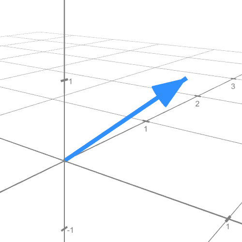
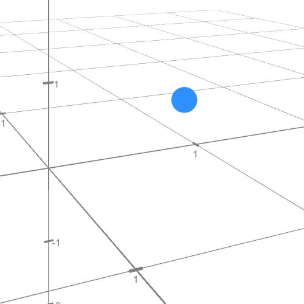

# Introduction

Assuming you've read the [Installation](Installation.md) guide, you should have Bardrix installed on your system. This guide will help you get started with Bardrix by creating a simple project.

## 1. Understanding 3D space

Before we start, let's understand the 3D space. In Bardrix, the 3D space is represented by the `vector3` and the `point3` classes. These classes have three components: `x`, `y`, and `z`. \
The classes are defined in the `bardrix/` namespace, their function are different, and they are not interchangeable. \
One must include the following headers to use these classes:

```cpp
#include <iostream>
#include <bardrix/vector3.h>
#include <bardrix/point3.h>
```

Now, we can use them for some simple mathematical operations.

```cpp
bardrix::vector3 v1(1, 2, 3);
bardrix::vector3 v2(4, 5, 6);
bardrix::point3 p1(1, 2, 3);

// All of these operations are also valid inverted (e.g. 6 - v1)
std::cout << "v1 + v2: " << v1 + v2 << '\n';
std::cout << "v1 - v2: " << v1 - v2 << '\n';
std::cout << "v1 * 2: " << v1 * 2 << '\n';
std::cout << "v1 / 2: " << v1 / 2 << '\n';

// You're able to add a vector to a point, but not a point to a vector
std::cout << "\np1 + v1: " << p1 + v1 << '\n';
// std::cout << "v1 + p1: " << v1 + p1 << '\n'; // This will not work
```

As we can see, adding a vector to a point is invalid due to the different purposes of these classes. \
A vector represents a direction in 3D space, it's always relative to the origin (0, 0, 0). \
We can see an example of this below (0.5, 0.5, 1):



A point in contrast represents a position in 3D space, it can be put anywhere but has no direction. \
We can see an example of this below (0.5, 0.5, 1):



With these things in mind we can start understanding why some operations are only available for `vector3` objects, and not for `point3` objects. \
This makes sense, as the length, angle, etc. are operations that are only valid for vectors; you can't calculate the length of a point. \
It's important to make the distinction between vectors and points, as they have different purposes in 3D space.

## 2. Advanced operations

There are some more advanced operations that can be done with these classes, such as the dot product and cross product. \
You can always check the [Mathematics](../Mathematics.md) guide for more information on these operations.

```cpp
bardrix::vector3 v1(1, 2, 3);
bardrix::vector3 v2(4, 5, 6);

std::cout << "v1 length: " << v1.length() << '\n';
std::cout << "v1 dot v2: " << v1.dot(v2) << '\n';
std::cout << "v1 cross v2: " << v1.cross(v2) << '\n';
```
