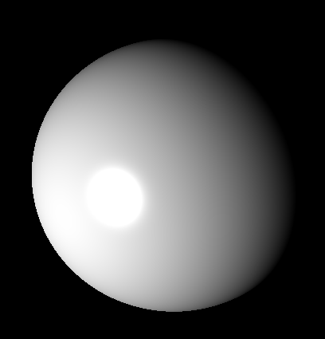

# Rayrtacing Reflections

This documentation is a continuation from [Raytracing](../Raytracing), here we'll focus on showing different
reflections. \
When you've gone through this document you should be able to have created something alike shown in the image below.



## Material

Let's start by introducing what a basic material is made out of.

- Ambient Coefficient
    - This is the amount of light that already present by default, think of a glow in the dark material.
- Diffuse Coefficient
    - This is the amount of light that is reflected in all directions, pretty much most materials that we see in real
      life.
- Specular Coefficient
    - This is a highlighted reflection, think of a mirror or a shiny surface.
- Shininess (Specular Exponent)
    - This is the size of the highlight, the higher the value the smaller the highlight.

If this doesn't yet make sense, you can look at the image at the top of this document. \
The bright light is the specular reflection (+highlight) and the way we're able to see the object is the diffuse
reflection. There is no ambient light in this scene.

## Phong Shading

In the previous document we've already calculated the color of a pixel, now we're going to add highlights to it.

```cpp
#include <bardrix/quaternion.h>
```

```cpp
/// \brief Calculates the light intensity at a given intersection point
/// \param shape The shape that was intersected
/// \param light The light source
/// \param camera The camera
/// \param intersection_point The intersection point of an object
/// \return The light intensity at the intersection point
/// \example double intensity = calculate_light_intensity(shape, light, camera, intersection_point);
double calculate_light_intensity(const bardrix::shape& shape, const bardrix::light& light, const bardrix::camera& camera,
const bardrix::point3& intersection_point) {
const bardrix::vector3 light_intersection_vector = intersection_point.vector_to(light.position).normalized();

// Angle between the normal and the light intersection vector
const double angle = shape.normal_at(intersection_point).dot(light_intersection_vector);

if (angle < 0) // This means the light is behind the intersection_point
return 0;

// Specular reflection
bardrix::vector3 reflection = bardrix::quaternion::mirror(light_intersection_vector,
shape.normal_at(intersection_point));
double specular_angle = reflection.dot(camera.position.vector_to(intersection_point).normalized());
double specular = std::pow(specular_angle, shape.get_material().get_shininess());

// We're calculating phong shading (ambient + diffuse + specular)
double intensity = shape.get_material().get_ambient();
intensity += shape.get_material().get_diffuse() * angle;
intensity += shape.get_material().get_specular() * specular;

// Max intensity is 1
return std::min(1.0, intensity * light.inverse_square_law(intersection_point));
}
```

In this code snippet we've added the specular reflection. \
The `bardrix::quaternion::mirror` function is a helper function that calculates the reflection of a vector. We could
have used the `bardrix::vector3::reflect` function as well, but since we know there won't be any degenerate cases (like
light being behind the object) we can use the simpler version.
