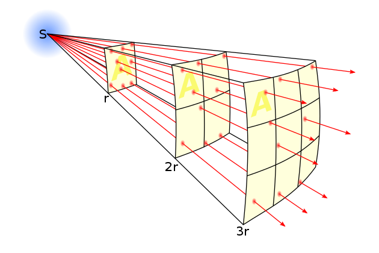

# Raytracing

This is a simple raytracing example. It demonstrates how to use the raytracing, it's a truly basic example, but it's a
good starting point for understanding how the raytracing works.

## Table of Contents

- [Introduction](#introduction)
- [1. Ray](#1-ray)
- [2. Light](#2-light)
  - [2.1. Light Intensity](#21-light-intensity)
- [3. Camera](#3-camera)
- [4. Sphere](#4-sphere)
  - [4.1 Sphere Intersection](#41-sphere-intersection)
  - [4.2 Sphere Normal](#42-sphere-normal)

## Introduction

In order to understand the basics, please refer to the [Introduction](../Introduction/README.md) guide. Here 3D space is
explained. \
This guide will assume you have a basic understanding of the `vector3` and `point3` classes.

In this example we'll go through setting up a camera and showing a simple sphere in the scene. \
The sphere will be rendered with light, camera and mathematically correct raytracing.


## 1. Ray

The ray is the most important part of the raytracing. It's a line that starts at a position, has a direction (where it's
pointing towards) and a length (how far it goes). The direction will always be normalized, so it's a unit vector.

```cpp
#include <bardrix/ray.h>
```

```cpp

bardrix::point3 origin(0, 0, 0);
bardrix::vector3 direction(10, 0, 0);
bardrix::ray ray(origin, direction);

std::cout << ray << std::endl;
std::cout << "ray end: " << ray.get_end() << std::endl; // This outputs a point3
```

```text
Output:
    Ray: origin: (0, 0, 0), direction: (1, 0, 0), length: 10
    ray end: (10, 0, 0)
```

Here we can see that the ray is automatically normalized (direction is 1) and the length is 10. \
This is a simple ray that goes from the origin (0, 0, 0) to the point (10, 0, 0).

## 2. Light

The light is a point in 3D space. It has a position, color and intensity. \
The intensity is a double value that can be infinitely large, sometimes expressed between 0 and 1.

```cpp
#include <bardrix/light.h>
```

```cpp
bardrix::point3 position(0, 0, 0);
bardrix::color color = bardrix::color::red();
double intensity = 1.0;

bardrix::light light(position, intensity, color);

std::cout << light << std::endl;
std::cout << "Inverse square law (1): " << light.inverse_square_law(1) << '\n';
std::cout << "Inverse square law (10): " << light.inverse_square_law(10) << '\n';
std::cout << "Inverse square law -> point3(1,2,3): " << light.inverse_square_law(bardrix::point3(1, 2, 3)) << '\n';
```

```text
Output:
    Light: (0, 0, 0), Intensity: 1, Color: (255, 0, 0, 255)
    Inverse square law (1): 1
    Inverse square law (10): 0.01
    Inverse square law -> point3(1,2,3): 0.0714286
```

Here we can see that the light is at the origin (0, 0, 0) with a red color and intensity of 1. \
The [Inverse-square law](https://en.wikipedia.org/wiki/Inverse-square_law) is a simple formula that calculates the
intensity of the light at a certain distance. \
The intensity is inversely proportional to the square of the distance from the source of the light.



## 2.1. Light Intensity

Light behaves differently when it hits an object, it's determined by the angle; when the angle is at 90 degrees it will have the most intensity (1).


In oder to calculate the intensity of the light at a certain point, we first need to calculate the angle between the
light and the intersection point. \
Then we can use the inverse square law to calculate the intensity of the light at that point.

```cpp
/// \brief Calculates the light intensity at a given intersection point
/// \param intersection_point The intersection point of an object
/// \param intersection_normal The normal of the intersection point
/// \param light The light source
/// \return The light intensity at the intersection point
/// \example double intensity = calculate_light_intensity(intersection_point, normal, light);
double calculate_light_intensity(const bardrix::point3& intersection_point, const bardrix::vector3& intersection_normal,
const bardrix::light& light)
{
const bardrix::vector3 light_intersection_vector = intersection_point.vector_to(light.position).normalized();

const double angle = intersection_normal.dot(light_intersection_vector);

if (angle < 0) // This means the light is behind the intersection_point
return 0;

// We use the angle and the inverse square law to calculate the intensity
return angle * light.inverse_square_law(intersection_point);
}
```

## 3. Camera

The camera is a point in 3D space. It has a position, direction, field of view and width/height. \
The field of view is the angle of the camera, it's how wide the camera can see.


Here is shown how the field of view works. The camera fov is 60 degrees which means there is less distortion at the
edges. \
The 120 degrees camera is a lot wider, which means there is more distortion at the edges.


And here is a comparison of the field of view in a game. \
The left image has a 60 degrees field of view, and the right image has a 120 degrees field of view.

```cpp
#include <bardrix/camera.h>
```

```cpp
bardrix::point3 position(0, 0, 0);
bardrix::vector3 direction(1, 0, 0);
unsigned fov = 60;
int width = 800;
int height = 600;

bardrix::camera camera(position, direction, width, height, fov);

std::cout << camera << '\n';
camera.look_at(bardrix::point3(1, 2, 3));
std::cout << "Looking at (1, 2, 3) now: " << camera.get_direction() << '\n';

std::cout << "Shoot ray at (width/2, height/2): " << *camera.shoot_ray(width/2, height/2, 100) << '\n';
```

```text
Output:
    Position: (0, 0, 0), Direction: (1, 0, 0), 800, 600, 60
    Looking at (1, 2, 3) now: (0.267261, 0.534522, 0.801784)
    Shoot ray at (width/2, height/2): Position: (0, 0, 0), Direction: (0.267261, 0.534522, 0.801784), Length: 100
```

Here we can see that the camera is at the origin (0, 0, 0) with a direction of (1, 0, 0). \
The camera has a width of 800, height of 600 and a field of view of 60 degrees.

We're able to look at points (or spheres, objects, etc.) by using the `look_at` function. \
And we can shoot a ray from the camera by using the `shoot_ray` function. Shooting rays is how the RAYtracing works.

## 4. Sphere

The sphere is a simple object in 3D space. It has a position, radius and material.

```cpp
class sphere : public bardrix::shape {
protected:
    /// \brief Radius of the sphere
    double radius_;

public:
    /// \brief Center of the sphere
    bardrix::point3 position;
};
```

Here we can see the base variables of the sphere.

## 4.1. Sphere Intersection

The intersection of the sphere is a simple mathematical formula. \
It calculates if a ray intersects with the sphere. If it does, it returns the intersection point.

For all kinds of complex and primitive shapes, the formulas can be
found [here](https://www.realtimerendering.com/intersections.html). \
Due to mathematics and unclear code; the formulas include terrible variable names.

```cpp
std::optional<bardrix::point3> sphere::intersection(const bardrix::ray& ray) const {
    // Get direction of the ray
    bardrix::vector3 direction = ray.get_direction();

    // Gets vector from points: ray origin and sphere center
    bardrix::vector3 ray_to_sphere_vector = ray.position.vector_to(position_);

    // Get dot product of origin-center-vector and normalized direction
    double dot = ray_to_sphere_vector.dot(direction);

    // Turn unit vector direction into a vector direction
    direction *= dot;

    // Length from ray origin to sphere center
    ray_to_sphere_vector = direction - ray_to_sphere_vector;

    // vec.dot(vec) == |vec|^2
    const double distance_squared = ray_to_sphere_vector.dot(ray_to_sphere_vector);

    // Radius^2
    const double radius_squared = radius_ * radius_;

    if (distance_squared > radius_squared)
        return std::nullopt; // A smart way to check if ray intersects before taking the sqrt

    // Calculate distance to intersection
    const double distance = dot - std::sqrt(radius_squared - distance_squared);

    // If we intersect sphere return the length
    return (distance < ray.get_length() && distance > 0)
           ? std::optional(ray.position + ray.get_direction() * distance)
           : std::nullopt;
}
```

In the picture we can see the visual representation of the intersection formula. \
Where pc is a vector from point (ray origin) to the center of the sphere. \
We're calculating `distance` which, if we add it to the ray direction, we get the intersection point `ray.point_at(distance)`.


[Here](https://iquilezles.org/articles/intersectors/) is a great resource for intersection formulas, though it has the
same naming problems like mentioned above, it can sometimes feel like deciphering hieroglyphs.

## 4.2 Sphere Normal

The normal of the sphere is a simple formula. It allows us to calculate the light intensity at the intersection point 
like in [Light Intensity](#21-light-intensity).


Here we can see that the normal is calculated by taking the center and pointing towards the intersection point. \
We also need to normalize the vector to make it a unit vector, so it's easier to calculate the angle.

```cpp
bardrix::vector3 sphere::normal_at(const bardrix::point3& point) const {
    return position_.vector_to(point).normalized();
}
```

With these tools you are able to create a 3D sphere and render it.