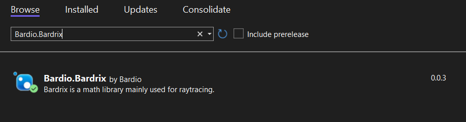

# Installation

Assuming you follow this guide, you will be able to use Bardrix in your project with this simple example:

```c++
#include <bardrix/vector3.h>
#include <iostream>

int main(){
    std::cout << bardrix::vector3(1,2,3) << std::endl;
}
```

## Table of Contents

- [Installation](#installation)
    - [CMake](#cmake)
        - [Submodule](#submodule)
        - [FetchContent](#fetchcontent)
    - [NuGet (Windows)](#nuget)
    - [Manual](#manual)
- [Dependencies](#dependencies)

## CMake

In order to use the project for CMake, you need to have CMake [installed](https://cmake.org/download/), or use an IDE
that supports CMake, such as Visual Studio, CLion, or QtCreator.

### Submodule

You can add the project as a submodule to your project by running the following command:

```bash
git submodule add https://github.com/BardoBard/Bardrix.git "Bardrix"
```

Then we can include the project in our CMakeLists.txt file:

```cmake
cmake_minimum_required(VERSION 3.27)
project(my_project)

set(CMAKE_CXX_STANDARD 17)

# Add Bardrix as a subdirectory
add_subdirectory(Bardrix)

# Add your project files
add_executable(${PROJECT_NAME} main.cpp)

# Add bardrix library
target_link_libraries(${PROJECT_NAME} Bardrix)
```

### FetchContent

If you don't want to use submodules, you can use the FetchContent module to download the project:

```cmake
cmake_minimum_required(VERSION 3.27)
project(my_project)

set(CMAKE_CXX_STANDARD 17)

include(FetchContent) # Include the FetchContent module

# Add Bardrix as a subdirectory
FetchContent_Declare(
        Bardrix
        GIT_REPOSITORY https://github.com/bardobard/Bardrix.git
#       GIT_TAG comes here # e.g. v0.0.4
)

FetchContent_MakeAvailable(Bardrix)

# Add your project files
add_executable(${PROJECT_NAME} main.cpp)

# Add bardrix library
target_link_libraries(${PROJECT_NAME} Bardrix)
```

The git tag is optional, you can use it to specify a version of the project you want to use.

## NuGet

You can also use the NuGet package manager to install Bardrix, this is only available for Windows users.


You can search for Bardio.Bardrix and install it, everything will be set up for you.



## Manual

You can also download the source code and include it in your project manually. This is not recommended as it is harder
to keep the project up to date.

# Dependencies

Bardrix has no dependencies, only the standard library is used.
